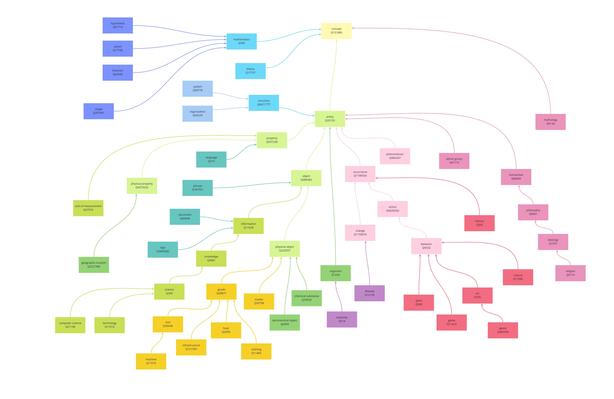

# Knowledge Bomber :bomb:

A "vocabulary test" minigame, testing knowledge of things vis-à-vis Wikipedia rather than knowledge of words vis-à-vis dictionary, available in the following 318 [languages](#Languages-ranking-table).

## Statistics of Wikipedia

Source of quizes of this application is data mined from Wikipedia.

### Qualified Wikidata items

A qualified article ([examples](data/sample-titles.csv)) should be a general, universal, common concept or knowledge, which satisfies these criteria:

- With more than *20* languages versions.
- Not a Onomatology (Anthroponymy, Taxon, Toponomastics, Hydronym, etc.), which is not a particular person, place, biota, event, chemical, astronomical object, company, product, publication, team, sport match, song, year, decade, day, unicode, etc. [exclusion criteria](src/wikiroamer.js)
- Can be [Hypernym](data/hypernyms.json) of (`instance_of?/subclass_of*`) items above.
- Not a disambiguation page.

### Hypernym Categories

Wikidata items / Wikipedia articles are categorized in the following hypernyms. The design purpose is to achieve balanced number of items/articles per hypernym category for gameplay, simplify as a tree, rather than building an ontologically precise semantic graph.

### Languages ranking table

Ranking is based on numbers of [qualified Wikidata items](#Qualified-Wikidata-items) per language. 

  - **`Q60`** is the number of qualified wikipedia articles with more than *60* language versions, so as `Q50` `Q40` `Q30` `Q20`.
  - **`WSM`**, weighted sum model, is square root of sum of squares of language_versions_count of all articles of each language.
  - **`Coverage%`** is the language WSM to English WSM ratio.
  - **`Articles`** is total [number of Wikipedia articles by language](https://meta.wikimedia.org/wiki/List_of_Wikipedias).
  - **`Solidness%`** is WSM to article ratio, using simple_english as 100% benchmark. Higher solidness means less proportion of trivial articles of that language.
  - **`Speakers`** is L1+L2 speakers of the language in thousand (source: wikipedia of each language).

| Rank |                     Language(Local) | Language                  | Wiki         | Coverage% |  Q60 :1st_place_medal: |  Q50 :2nd_place_medal: | Q40 :3rd_place_medal: | Q30 :medal_sports: | Q20 :medal_military: |     WSM | Articles | Solidness% | Speakers |
|-----|------------------------------------:|---------------------------|--------------|----------:|-----:|-----:|------:|------:|------:|--------:|---------:|-----------:|---------:|
| 1   |                             English | English                   | en           |   100.00% | 5243 | 7803 | 12467 | 20894 | 38391 | 9053.59 |  6356841 |      3.71% |  1348000 |
| 2   |                             Español | Spanish                   | es           |    98.20% | 5234 | 7757 | 12318 | 20436 | 36497 | 8971.77 |  1707441 |     14.51% |   586000 |
| 3   |                            Français | French                    | fr           |    98.02% | 5220 | 7746 | 12290 | 20359 | 36400 | 8963.31 |  2352282 |     10.50% |   274000 |
| 4   |                             Русский | Russian                   | ru           |    97.65% | 5229 | 7763 | 12337 | 20317 | 35752 | 8946.75 |  1745922 |     13.89% |   258000 |
| 5   |                             Deutsch | German                    | de           |    95.84% | 5126 | 7578 | 12010 | 19830 | 35134 | 8863.35 |  2605111 |      9.26% |   135000 |
| 6   |                          Українська | Ukrainian                 | uk           |    95.59% | 5238 | 7785 | 12333 | 19942 | 32942 | 8851.52 |  1108878 |     21.61% |    40000 |
| 7   |                           Português | Portuguese                | pt           |    94.98% | 5151 | 7630 | 12074 | 19687 | 33461 | 8823.33 |  1072940 |     22.23% |   274000 |
| 8   |                            Italiano | Italian                   | it           |    94.92% | 5135 | 7602 | 11995 | 19569 | 33996 | 8820.44 |  1710794 |     13.89% |    85000 |
| 9   |                                中文 | Chinese                   | zh           |    94.72% | 5225 | 7748 | 12205 | 19635 | 32354 | 8811.46 |  1219266 |     19.45% |  1120000 |
| 10  |                              日本語 | Japanese                  | ja           |    94.48% | 5206 | 7702 | 12103 | 19487 | 32576 | 8800.21 |  1283967 |     18.53% |   128000 |
| 11  |                          Nederlands | Dutch                     | nl           |    93.70% | 5235 | 7703 | 12039 | 19272 | 31495 | 8763.79 |  2063763 |     11.42% |    30000 |
| 12  |                             العربية | Arabic                    | ar           |    93.16% | 5241 | 7764 | 12083 | 19120 | 30652 | 8738.31 |  1130762 |     20.69% |   274000 |
| 13  |                              Polski | Polish                    | pl           |    93.15% | 5120 | 7535 | 11880 | 19215 | 31978 | 8737.80 |  1485334 |     15.75% |    45000 |
| 14  |                              Català | Catalan                   | ca           |    92.75% | 5192 | 7663 | 11983 | 19038 | 30625 | 8719.11 |   685492 |     33.96% |    10000 |
| 15  |                               فارسی | Persian                   | fa           |    92.00% | 5242 | 7796 | 12076 | 18795 | 29228 | 8684.00 |   824096 |     28.10% |    74000 |
| 16  |                             Svenska | Swedish                   | sv           |    91.00% | 5109 | 7526 | 11762 | 18645 | 29356 | 8636.44 |  2971438 |      7.72% |    13000 |
| 17  |                              한국어 | Korean                    | ko           |    90.94% | 5213 | 7676 | 11864 | 18497 | 28649 | 8633.64 |   547424 |     41.99% |    82000 |
| 18  |                             Čeština | Czech                     | cs           |    88.43% | 5073 | 7450 | 11537 | 17855 | 27142 | 8513.53 |   486356 |     46.00% |    14000 |
| 19  |                               Suomi | Finnish                   | fi           |    87.48% | 5048 | 7406 | 11437 | 17553 | 26366 | 8468.07 |   514053 |     42.92% |     6000 |
| 20  |                    Bahasa Indonesia | Indonesian                | id           |    86.46% | 5116 | 7466 | 11327 | 16975 | 25235 | 8418.19 |   591438 |     36.74% |   199000 |
| 21  |                              Türkçe | Turkish                   | tr           |    85.75% | 5062 | 7388 | 11215 | 16906 | 24768 | 8383.65 |   422438 |     51.25% |    88000 |
| 22  |                      Norsk (Bokmål) | Norwegian (Bokmål)        | no           |    84.35% | 5001 | 7258 | 11037 | 16608 | 24041 | 8314.88 |   560655 |     37.98% |     5000 |
| 23  |                               עברית | Hebrew                    | he           |    83.60% | 4949 | 7173 | 10814 | 16228 | 23801 | 8277.89 |   300764 |     70.09% |     9000 |
| 24  |                     Српски / Srpski | Serbian                   | sr           |    81.28% | 5123 | 7399 | 10840 | 15156 | 20209 | 8162.31 |   648605 |     31.49% |    12000 |
| 25  |                           Esperanto | Esperanto                 | eo           |    80.47% | 5050 | 7237 | 10599 | 14888 | 20257 | 8121.74 |   301368 |     67.31% |      180 |
| 26  |                          Tiếng Việt | Vietnamese                | vi           |    79.39% | 5019 | 7119 | 10234 | 14428 | 19997 | 8066.81 |  1267882 |     15.75% |    77000 |
| 27  |                           Български | Bulgarian                 | bg           |    78.36% | 4994 | 7159 | 10364 | 14319 | 18747 | 8014.30 |   273950 |     72.25% |     8000 |
| 28  |                             Euskara | Basque                    | eu           |    77.71% | 5019 | 7119 | 10165 | 13898 | 18130 | 7981.13 |   378133 |     51.87% |     1000 |
| 29  |                               Dansk | Danish                    | da           |    77.64% | 4817 | 6868 | 10071 | 14326 | 19412 | 7977.20 |   268668 |     72.87% |     6000 |
| 30  |                              Română | Romanian                  | ro           |    77.08% | 4905 | 6943 | 10016 | 13901 | 18466 | 7948.41 |   421897 |     46.00% |    29000 |
| 31  |                      Simple English | Simple English            | simple       |    76.56% | 4916 | 6975 |  9939 | 13655 | 17989 | 7921.57 |   193746 |     99.73% |          |
| 32  |                               Eesti | Estonian                  | et           |    75.06% | 4783 | 6735 |  9646 | 13322 | 17567 | 7843.53 |   221340 |     85.52% |     1000 |
| 33  |                              Magyar | Hungarian                 | hu           |    74.34% | 4591 | 6467 |  9413 | 13380 | 18582 | 7806.20 |   490921 |     38.29% |    13000 |
| 34  |                            Hrvatski | Croatian                  | hr           |    73.09% | 4804 | 6678 |  9333 | 12485 | 15960 | 7740.02 |   209520 |     87.99% |     6000 |
| 35  |                            Ελληνικά | Greek                     | el           |    70.91% | 4604 | 6367 |  8845 | 11907 | 15433 | 7623.80 |   196567 |     91.08% |    14000 |
| 36  |     Srpskohrvatski / Српскохрватски | Serbo-Croatian            | sh           |    70.69% | 4692 | 6415 |  8866 | 11677 | 14868 | 7611.90 |   455401 |     39.21% |    21000 |
| 37  |                              Galego | Galician                  | gl           |    69.64% | 4655 | 6301 |  8634 | 11279 | 14376 | 7555.51 |   175404 |    100.34% |     2000 |
| 38  |                            Lietuvių | Lithuanian                | lt           |    69.56% | 4576 | 6276 |  8653 | 11489 | 14662 | 7551.09 |   199147 |     88.30% |     3000 |
| 39  |                          Slovenčina | Slovak                    | sk           |    69.06% | 4475 | 6205 |  8648 | 11577 | 14822 | 7523.50 |   237445 |     73.48% |     5000 |
| 40  |                             Հայերեն | Armenian                  | hy           |    67.98% | 4395 | 6009 |  8310 | 11288 | 14693 | 7464.67 |   286960 |     59.90% |     7000 |
| 41  |                                 ไทย | Thai                      | th           |    66.82% | 4387 | 5896 |  8007 | 10667 | 13828 | 7400.72 |   138940 |    121.65% |    61000 |
| 42  |                                粵語 | Cantonese                 | zh-yue       |    66.00% | 4626 | 6021 |  7741 |  9739 | 12106 | 7354.90 |   118063 |    141.41% |    85000 |
| 43  |                       Bahasa Melayu | Malay                     | ms           |    65.92% | 4391 | 5889 |  7846 | 10304 | 13028 | 7350.58 |   352200 |     47.24% |   200000 |
| 44  |                         Slovenščina | Slovenian                 | sl           |    65.38% | 4201 | 5764 |  7937 | 10529 | 13534 | 7320.59 |   173323 |     95.40% |     2000 |
| 45  |                          Беларуская | Belarusian                | be           |    64.98% | 4375 | 5754 |  7686 |  9943 | 12601 | 7297.89 |   207326 |     79.04% |    11000 |
| 46  |                        Azərbaycanca | Azerbaijani               | az           |    63.46% | 4215 | 5638 |  7591 |  9720 | 12216 | 7212.14 |   178129 |     90.16% |    23000 |
| 47  |                             Nynorsk | Norwegian (Nynorsk)       | nn           |    62.83% | 4160 | 5487 |  7355 |  9495 | 11797 | 7176.39 |   159271 |     99.73% |     5000 |
| 48  |                               हिन्दी | Hindi                     | hi           |    62.00% | 4108 | 5463 |  7252 |  9351 | 11695 | 7129.08 |   149364 |    104.98% |   600000 |
| 49  |                                தமிழ் | Tamil                     | ta           |    61.69% | 4155 | 5430 |  7054 |  8945 | 11119 | 7110.82 |   139681 |    111.46% |    85000 |
| 50  |                            Latviešu | Latvian                   | lv           |    61.68% | 4538 | 5617 |  6858 |  8116 |  9350 | 7110.47 |   108552 |    143.57% |     2000 |
| 51  |                                吴语 | Wu                        | wuu          |    61.15% | 5169 | 6104 |  6621 |  7175 |  7741 | 7079.69 |    42659 |    362.48% |    82000 |
| 52  |                          Македонски | Macedonian                | mk           |    58.61% | 3911 | 5125 |  6672 |  8366 | 10149 | 6930.91 |   116247 |    127.51% |     2000 |
| 53  |                             Қазақша | Kazakh                    | kk           |    57.93% | 3771 | 5022 |  6687 |  8568 | 10656 | 6890.84 |   228732 |     63.91% |    19000 |
| 54  |                              Latina | Latin                     | la           |    56.60% | 3886 | 4815 |  6020 |  7387 |  8979 | 6811.10 |   135694 |    105.28% |          |
| 55  |                           Asturianu | Asturian                  | ast          |    56.48% | 3878 | 4981 |  6196 |  7441 |  8736 | 6804.12 |   127981 |    111.46% |     1000 |
| 56  |                               বাংলা | Bengali                   | bn           |    55.68% | 3667 | 4738 |  6124 |  7608 |  9375 | 6755.51 |   111286 |    126.59% |   268000 |
| 57  |                             ქართული | Georgian                  | ka           |    54.57% | 3593 | 4675 |  5998 |  7634 |  9347 | 6687.94 |   155352 |     88.61% |     4000 |
| 58  |                           Afrikaans | Afrikaans                 | af           |    54.25% | 3687 | 4623 |  5796 |  6937 |  8099 | 6668.11 |    99540 |    137.70% |    17500 |
| 59  |                                اردو | Urdu                      | ur           |    52.84% | 3523 | 4358 |  5450 |  6655 |  8056 | 6581.41 |   164792 |     80.89% |   230000 |
| 60  |                            Íslenska | Icelandic                 | is           |    52.42% | 3508 | 4377 |  5406 |  6495 |  7528 | 6555.15 |    53108 |    249.78% |      314 |
| 61  |                            Bosanski | Bosnian                   | bs           |    51.59% | 3432 | 4340 |  5386 |  6572 |  7725 | 6503.06 |    86787 |    150.36% |     2500 |
| 62  |                              മലയാളം | Malayalam                 | ml           |    50.96% | 3368 | 4192 |  5238 |  6416 |  7703 | 6463.02 |    75182 |    171.36% |    35000 |
| 63  |                             Gaeilge | Irish                     | ga           |    49.20% | 3313 | 4121 |  5109 |  6070 |  6955 | 6350.62 |    55410 |    224.46% |      658 |
| 64  |                             Cymraeg | Welsh                     | cy           |    48.14% | 3207 | 3869 |  4626 |  5448 |  6190 | 6281.92 |   133353 |     91.08% |     1000 |
| 65  |                             Tagalog | Tagalog                   | tl           |    47.00% | 3072 | 3714 |  4503 |  5340 |  6182 | 6206.65 |    45609 |    260.59% |    65000 |
| 66  |                              O‘zbek | Uzbek                     | uz           |    46.61% | 3041 | 3800 |  4733 |  5715 |  6675 | 6181.05 |   138255 |     85.22% |    34000 |
| 67  |            Беларуская (тарашкевіца) | Belarusian (Taraškievica) | be-tarask    |    46.52% | 3034 | 3625 |  4387 |  5197 |  6009 | 6175.24 |    75554 |    155.61% |    11000 |
| 68  |                             Occitan | Occitan                   | oc           |    45.72% | 3022 | 3603 |  4290 |  4910 |  5495 | 6121.66 |    86785 |    133.07% |     1000 |
| 69  |                               Shqip | Albanian                  | sq           |    44.41% | 2830 | 3472 |  4183 |  4900 |  5701 | 6033.15 |    83541 |    134.31% |     7000 |
| 70  |                          Bân-lâm-gú | Min Nan                   | zh-min-nan   |    43.13% | 2720 | 3219 |  3788 |  4347 |  4943 | 5946.11 |   430859 |     25.32% |    49000 |
| 71  |                            Кыргызча | Kirghiz                   | ky           |    41.08% | 2604 | 3253 |  4054 |  4913 |  5687 | 5803.08 |    80864 |    128.44% |     4000 |
| 72  |                               ਪੰਜਾਬੀ | Punjabi                   | pa           |    41.08% | 2604 | 3044 |  3526 |  4047 |  4614 | 5802.50 |    36158 |    287.45% |    52000 |
| 73  |                           Brezhoneg | Breton                    | br           |    40.83% | 2457 | 2965 |  3687 |  4423 |  5314 | 5785.21 |    69802 |    147.89% |      230 |
| 74  |                           Kiswahili | Swahili                   | sw           |    40.39% | 2512 | 2877 |  3282 |  3650 |  4062 | 5753.92 |    66023 |    154.69% |    69000 |
| 75  |                      Soranî / کوردی | Sorani                    | ckb          |    40.26% | 2500 | 2973 |  3516 |  4045 |  4588 | 5744.28 |    34007 |    299.49% |     8000 |
| 76  |                           Basa Jawa | Javanese                  | jv           |    38.47% | 2307 | 2759 |  3282 |  3943 |  4869 | 5615.44 |    64509 |    150.67% |    68000 |
| 77  |                                 Ido | Ido                       | io           |    38.08% | 2341 | 2839 |  3458 |  4114 |  4760 | 5587.21 |    30357 |    317.40% |        3 |
| 78  |                             Winaray | Waray-Waray               | war          |    37.68% | 2373 | 2591 |  2768 |  2963 |  3112 | 5557.48 |  1265463 |      7.41% |     4000 |
| 79  | شاہ مکھی پنجابی (Shāhmukhī Pañjābī) | Western Punjabi           | pnb          |    37.10% | 2162 | 2486 |  2851 |  3302 |  3823 | 5514.17 |    63665 |    147.27% |    65000 |
| 80  |                               मराठी | Marathi                   | mr           |    36.22% | 2155 | 2482 |  2831 |  3197 |  3637 | 5448.86 |    78350 |    116.71% |    99000 |
| 81  |                                ಕನ್ನಡ | Kannada                   | kn           |    35.94% | 2216 | 2663 |  3128 |  3616 |  4196 | 5427.40 |    26968 |    337.16% |    59000 |
| 82  |                               Frysk | West Frisian              | fy           |    35.90% | 2136 | 2571 |  3114 |  3674 |  4310 | 5424.63 |    46169 |    196.68% |      470 |
| 83  |                            Aragonés | Aragonese                 | an           |    34.45% | 1937 | 2206 |  2515 |  2819 |  3120 | 5313.94 |    40394 |    215.82% |       60 |
| 84  |                               Scots | Scots                     | sco          |    34.09% | 2140 | 2518 |  2749 |  2913 |  3101 | 5286.40 |    40475 |    213.04% |     1541 |
| 85  |                               తెలుగు | Telugu                    | te           |    33.61% | 2003 | 2347 |  2736 |  3136 |  3619 | 5248.53 |    72229 |    117.63% |    96000 |
| 86  |                   Tatarça / Татарча | Tatar                     | tt           |    33.38% | 1930 | 2223 |  2584 |  2949 |  3323 | 5230.58 |   300104 |     28.10% |     5000 |
| 87  |                               ייִדיש | Yiddish                   | yi           |    33.13% | 1860 | 2063 |  2279 |  2485 |  2684 | 5211.13 |    15253 |    549.58% |     1500 |
| 88  |                         Interlingua | Interlingua               | ia           |    32.63% | 1885 | 2155 |  2458 |  2719 |  2971 | 5171.37 |    23203 |    355.68% |        2 |
| 89  |                               Чăваш | Chuvash                   | cv           |    32.04% | 1903 | 2234 |  2649 |  3094 |  3530 | 5124.60 |    46426 |    174.45% |     1000 |
| 90  |                              Тоҷикӣ | Tajik                     | tg           |    31.61% | 1831 | 2175 |  2527 |  2906 |  3300 | 5089.87 |   103910 |     76.88% |     8000 |
| 91  |                          မြန်မာဘာသာ | Burmese                   | my           |    31.52% | 1820 | 2095 |  2434 |  2752 |  3110 | 5082.85 |   101284 |     78.73% |    43000 |
| 92  |                       Kurdî / كوردی | Kurdish                   | ku           |    31.17% | 1795 | 2036 |  2295 |  2539 |  2777 | 5054.52 |    47862 |    164.57% |    30000 |
| 93  |                         Alemannisch | Alemannic                 | als          |    31.10% | 1695 | 1950 |  2286 |  2567 |  2901 | 5049.16 |    27891 |    282.20% |     7000 |
| 94  |                           Sicilianu | Sicilian                  | scn          |    30.88% | 1768 | 2004 |  2319 |  2585 |  2858 | 5030.75 |    26176 |    298.25% |     5000 |
| 95  |                             Башҡорт | Bashkir                   | ba           |    30.50% | 1636 | 1865 |  2089 |  2349 |  2648 | 4999.65 |    57663 |    133.69% |     1000 |
| 96  |                      Lëtzebuergesch | Luxembourgish             | lb           |    29.35% | 1675 | 2038 |  2489 |  3000 |  3557 | 4904.58 |    60130 |    123.50% |     1000 |
| 97  |                           Runa Simi | Quechua                   | qu           |    28.82% | 1574 | 1712 |  1824 |  1915 |  1985 | 4860.14 |    22905 |    318.32% |    15000 |
| 98  |                        مصرى (Maṣri) | Egyptian Arabic           | arz          |    28.78% | 1630 | 1940 |  2272 |  2660 |  3199 | 4857.26 |  1318750 |      5.25% |    70000 |
| 99  |                              Монгол | Mongolian                 | mn           |    28.06% | 1544 | 1796 |  2049 |  2309 |  2560 | 4795.92 |    20763 |    341.79% |     5000 |
| 100 |                            Limburgs | Limburgish                | li           |    27.60% | 1470 | 1624 |  1788 |  1985 |  2143 | 4756.68 |    13480 |    518.09% |     1300 |
| 101 |                               नेपाली | Nepali                    | ne           |    27.43% | 1489 | 1684 |  1925 |  2170 |  2466 | 4741.30 |    32098 |    216.13% |    16000 |
| 102 |                              تۆرکجه | South Azerbaijani         | azb          |    27.21% | 1472 | 1671 |  1890 |  2074 |  2269 | 4722.27 |   240611 |     28.41% |    13000 |
| 103 |                                සිංහල | Sinhalese                 | si           |    27.09% | 1581 | 1865 |  2166 |  2505 |  2904 | 4711.92 |    17294 |    396.13% |    20000 |
| 104 |                          Basa Sunda | Sundanese                 | su           |    26.68% | 1465 | 1664 |  1876 |  2090 |  2309 | 4676.38 |    60924 |    110.53% |    42000 |
| 105 |                            Lumbaart | Lombard                   | lmo          |    26.60% | 1382 | 1634 |  1975 |  2326 |  2701 | 4669.47 |    47940 |    140.17% |     4000 |
| 106 |                      Krèyol ayisyen | Haitian                   | ht           |    24.96% | 1368 | 1562 |  1747 |  1915 |  2047 | 4522.78 |    62757 |    100.34% |    10000 |
| 107 |                           მარგალური | Mingrelian                | xmf          |    24.04% | 1273 | 1409 |  1542 |  1670 |  1769 | 4439.18 |    16421 |    370.50% |      340 |
| 108 |                          Žemaitėška | Samogitian                | bat-smg      |    23.32% | 1062 | 1139 |  1239 |  1313 |  1414 | 4372.19 |    16905 |    348.89% |      400 |
| 109 |                            Malagasy | Malagasy                  | mg           |    23.04% | 1123 | 1253 |  1413 |  1594 |  1810 | 4345.80 |    94038 |     61.75% |    25000 |
| 110 |                              Vèneto | Venetian                  | vec          |    22.98% | 1110 | 1260 |  1453 |  1663 |  1885 | 4340.49 |    68185 |     85.22% |     3900 |
| 111 |                        سندھی ، सिन्ध | Sindhi                    | sd           |    22.64% | 1189 | 1345 |  1519 |  1715 |  1929 | 4308.01 |    14659 |    390.88% |    32000 |
| 112 |                              Zazaki | Zazaki                    | diq          |    22.37% | 1131 | 1281 |  1453 |  1634 |  1769 | 4281.74 |    40020 |    141.41% |     1340 |
| 113 |                            Gàidhlig | Scottish Gaelic           | gd           |    22.24% | 1106 | 1214 |  1330 |  1429 |  1529 | 4269.75 |    15470 |    363.71% |      150 |
| 114 |                        Plattdüütsch | Low Saxon                 | nds          |    22.15% | 1155 | 1338 |  1561 |  1790 |  2066 | 4261.28 |    82623 |     67.62% |    10000 |
| 115 |                          Русиньскый | Rusyn                     | rue          |    21.95% | 1028 | 1122 |  1209 |  1285 |  1355 | 4241.49 |     8163 |    680.18% |      630 |
| 116 |                           Саха тыла | Sakha                     | sah          |    21.91% | 1049 | 1140 |  1242 |  1318 |  1424 | 4237.35 |    13304 |    416.51% |      450 |
| 117 |                               Walon | Walloon                   | wa           |    21.69% | 1105 | 1249 |  1403 |  1545 |  1698 | 4216.22 |    11214 |    489.37% |      900 |
| 118 |                            Boarisch | Bavarian                  | bar          |    21.57% | 1096 | 1255 |  1447 |  1664 |  1942 | 4205.03 |    31646 |    172.28% |    14000 |
| 119 |                           नेपाल भाषा | Newar                     | new          |    21.41% |  989 | 1059 |  1168 |  1274 |  1396 | 4189.04 |    72322 |     74.72% |      860 |
| 120 |                            Soomaali | Somali                    | so           |    21.27% | 1028 | 1154 |  1268 |  1372 |  1490 | 4175.00 |     6306 |    853.39% |    22000 |
| 121 |                                پښتو | Pashto                    | ps           |    21.00% | 1034 | 1148 |  1285 |  1422 |  1555 | 4149.01 |    12414 |    427.93% |    50000 |
| 122 |                                አማርኛ | Amharic                   | am           |    20.82% |  878 |  960 |  1023 |  1110 |  1195 | 4131.06 |    14961 |    351.98% |    57000 |
| 123 |                  Hak-kâ-fa / 客家話 | Hakka                     | hak          |    19.77% |  889 |  949 |  1031 |  1123 |  1213 | 4025.19 |     9417 |    531.05% |    44000 |
| 124 |                  Lingua franca nova | Lingua Franca Nova        | lfn          |    19.61% | 1047 | 1187 |  1339 |  1504 |  1689 | 4009.27 |     4128 |  1,201.97% |        1 |
| 125 |                             Ilokano | Ilokano                   | ilo          |    19.38% |  756 |  787 |   830 |   873 |   937 | 3986.00 |    15357 |    319.25% |    10000 |
| 126 |                              অসমীয়া | Assamese                  | as           |    19.35% |  914 |  999 |  1102 |  1205 |  1355 | 3982.82 |     9055 |    540.63% |    15000 |
| 127 |                          Nordfriisk | North Frisian             | frr          |    19.27% |  922 | 1011 |  1097 |  1173 |  1240 | 3973.89 |    13934 |    349.82% |       10 |
| 128 |                       Mìng-dĕ̤ng-ngṳ̄ | Min Dong                  | cdo          |    18.86% |  849 |  912 |   986 |  1064 |  1151 | 3932.04 |    15504 |    307.83% |    10000 |
| 129 |                             Нохчийн | Chechen                   | ce           |    18.81% |  825 |  913 |   997 |  1081 |  1169 | 3926.48 |   398537 |     11.73% |     2000 |
| 130 |                              भोजपुरी | Bhojpuri                  | bh           |    18.15% |  816 |  928 |  1044 |  1162 |  1285 | 3857.08 |     7540 |    609.17% |    52000 |
| 131 |                             Avañeʼẽ | Guarani                   | gn           |    17.90% |  742 |  804 |   859 |   893 |   916 | 3830.61 |     4187 |  1,081.87% |     7000 |
| 132 |                                Võro | Võro                      | fiu-vro      |    17.54% |  717 |  751 |   790 |   829 |   866 | 3791.17 |     5845 |    759.22% |       87 |
| 133 |                            Føroyskt | Faroese                   | fo           |    17.21% |  776 |  834 |   880 |   932 |   968 | 3755.73 |    13617 |    319.56% |       72 |
| 134 |                       古文 / 文言文 | Classical Chinese         | zh-classical |    17.20% |  825 |  949 |  1097 |  1242 |  1433 | 3754.46 |    10965 |    396.75% |          |
| 135 |                          Piemontèis | Piedmontese               | pms          |    17.12% |  873 |  973 |  1115 |  1258 |  1417 | 3746.13 |    65843 |     65.76% |     2000 |
| 136 |                    Kriyòl Gwiyannen | Guianan Creole            | gcr          |    16.83% |  700 |  728 |   742 |   753 |   761 | 3713.82 |     1046 |  4,070.90% |      300 |
| 137 |                            chiShona | Shona                     | sn           |    16.41% |  758 |  825 |   877 |   938 |   973 | 3667.59 |     7246 |    573.04% |    15000 |
| 138 |                              ગુજરાતી | Gujarati                  | gu           |    16.25% |  821 |  912 |  1020 |  1151 |  1300 | 3649.69 |    29517 |    139.25% |    62000 |
| 139 |                          Fiji Hindi | Fiji Hindi                | hif          |    16.01% |  638 |  657 |   673 |   686 |   700 | 3623.12 |     9932 |    407.86% |      460 |
| 140 |                              Буряад | Buryat                    | bxr          |    16.00% |  599 |  635 |   682 |   718 |   745 | 3621.03 |     2689 |  1,505.48% |      590 |
| 141 |                           Taqbaylit | Kabyle                    | kab          |    15.84% |  723 |  795 |   850 |   918 |   965 | 3603.83 |     6199 |    646.84% |     6000 |
| 142 |                     Jumiekan Kryuol | Jamaican Patois           | jam          |    15.81% |  702 |  730 |   743 |   762 |   774 | 3600.08 |     1669 |  2,397.46% |     3200 |
| 143 |                       Nedersaksisch | Dutch Low Saxon           | nds-nl       |    15.68% |  658 |  737 |   839 |   951 |  1063 | 3584.62 |     7271 |    545.57% |          |
| 144 |               Sinugboanong Binisaya | Cebuano                   | ceb          |    15.41% |  604 |  651 |   716 |   807 |   902 | 3553.68 |  5885623 |      0.62% |    28000 |
| 145 |                             ᱥᱟᱱᱛᱟᱲᱤ | Santali                   | sat          |    15.35% |  682 |  744 |   799 |   852 |   908 | 3547.19 |     6350 |    611.64% |     7600 |
| 146 |                              Yorùbá | Yoruba                    | yo           |    15.20% |  650 |  691 |   740 |   794 |   887 | 3529.38 |    33423 |    114.86% |    43000 |
| 147 |                               Sardu | Sardinian                 | sc           |    15.02% |  629 |  703 |   776 |   846 |   925 | 3508.47 |     7069 |    537.54% |     1300 |
| 148 |                                贛語 | Gan                       | gan          |    15.00% |  605 |  640 |   673 |   707 |   745 | 3506.23 |     6451 |    588.17% |    22000 |
| 149 |                               Gaelg | Manx                      | gv           |    14.83% |  604 |  657 |   719 |   763 |   814 | 3487.05 |     5045 |    744.09% |        2 |
| 150 |                               བོད་སྐད | Tibetan                   | bo           |    14.60% |  670 |  755 |   837 |   925 |  1020 | 3459.32 |     5964 |    619.36% |     1200 |
| 151 |                             Lingala | Lingala                   | ln           |    14.57% |  615 |  656 |   692 |   729 |   772 | 3455.85 |     3229 |  1,141.77% |    25000 |
| 152 |                         ئۇيغۇر تىلى | Uyghur                    | ug           |    14.10% |  626 |  675 |   715 |   773 |   844 | 3399.32 |     5072 |    703.34% |    10000 |
| 153 |                              Vepsän | Vepsian                   | vep          |    14.02% |  525 |  559 |   601 |   642 |   680 | 3389.78 |     6665 |    532.29% |        4 |
| 154 |                                 ລາວ | Lao                       | lo           |    13.99% |  549 |  597 |   651 |   703 |   744 | 3386.51 |     3829 |    924.71% |    30000 |
| 155 |                           Estremeñu | Extremaduran              | ext          |    13.98% |  482 |  512 |   544 |   588 |   628 | 3384.68 |     3289 |  1,075.39% |      200 |
| 156 |                               Bikol | Central Bicolano          | bcl          |    13.97% |  553 |  599 |   645 |   698 |   759 | 3384.14 |    11227 |    314.93% |     2500 |
| 157 |                               संस्कृतम् | Sanskrit                  | sa           |    13.92% |  560 |  606 |   663 |   735 |   849 | 3377.38 |    11522 |    305.36% |          |
| 158 |                                 ଓଡ଼ିଆ | Oriya                     | or           |    13.80% |  668 |  796 |   975 |  1202 |  1492 | 3362.82 |    15774 |    221.07% |    40000 |
| 159 |                  Nouormand/Normaund | Norman                    | nrm          |    13.44% |  508 |  544 |   585 |   621 |   662 | 3319.40 |     4579 |    742.86% |      110 |
| 160 |                              Иронау | Ossetian                  | os           |    13.37% |  542 |  599 |   652 |   711 |   775 | 3310.02 |    13756 |    245.77% |      600 |
| 161 |                             Ślůnski | Silesian                  | szl          |    13.35% |  534 |  589 |   662 |   721 |   781 | 3307.61 |    54248 |     62.06% |      510 |
| 162 |                               ܐܪܡܝܐ | Aramaic                   | arc          |    13.14% |  586 |  626 |   656 |   668 |   675 | 3282.09 |     1773 |  1,875.67% |     1000 |
| 163 |                   Kernowek/Karnuack | Cornish                   | kw           |    13.05% |  440 |  459 |   482 |   499 |   521 | 3270.53 |     4661 |    708.28% |          |
| 164 |                             Nāhuatl | Nahuatl                   | nah          |    13.05% |  501 |  530 |   553 |   583 |   623 | 3270.08 |     7001 |    471.47% |     1700 |
| 165 |             Олык Марий (Olyk Marij) | Meadow Mari               | mhr          |    12.95% |  551 |  599 |   654 |   706 |   749 | 3258.26 |    10238 |    319.87% |      470 |
| 166 |                              Kabɩyɛ | Kabiye                    | kbp          |    12.90% |  481 |  508 |   523 |   530 |   540 | 3252.37 |     1683 |  1,940.51% |     1000 |
| 167 |                             Englisc | Anglo-Saxon               | ang          |    12.73% |  497 |  529 |   566 |   604 |   658 | 3229.63 |     3334 |    965.78% |          |
| 168 |                              Furlan | Friulian                  | fur          |    12.47% |  479 |  505 |   534 |   560 |   577 | 3197.61 |     3446 |    916.07% |      600 |
| 169 |                              Lìgure | Ligurian                  | lij          |    12.16% |  466 |  496 |   519 |   553 |   580 | 3157.59 |    10706 |    287.45% |      600 |
| 170 |                            Mirandés | Mirandese                 | mwl          |    12.15% |  488 |  522 |   551 |   589 |   654 | 3155.43 |     3859 |    796.58% |       15 |
| 171 |                          West-Vlams | West Flemish              | vls          |    11.93% |  508 |  568 |   649 |   699 |   764 | 3127.12 |     7449 |    405.08% |     1400 |
| 172 |                            ភាសាខ្មែរ | Khmer                     | km           |    11.80% |  479 |  541 |   620 |   707 |   799 | 3109.42 |     8315 |    358.77% |    16000 |
| 173 |                         Minangkabau | Minangkabau               | min          |    11.62% |  454 |  489 |   525 |   562 |   614 | 3086.02 |   224731 |     12.97% |     5500 |
| 174 |                             Türkmen | Turkmen                   | tk           |    11.36% |  469 |  508 |   548 |   601 |   643 | 3051.26 |     5984 |    480.11% |    11000 |
| 175 |                  Emiliàn e rumagnòl | Emilian-Romagnol          | eml          |    11.34% |  457 |  511 |   588 |   672 |   777 | 3048.97 |    12879 |    222.61% |     1800 |
| 176 |               Эрзянь (Erzjanj Kelj) | Erzya                     | myv          |    11.17% |  420 |  453 |   488 |   526 |   568 | 3025.84 |     6536 |    432.25% |      610 |
| 177 |                            ГӀалгӀай | Ingush                    | inh          |    11.06% |  376 |  393 |   411 |   435 |   454 | 3011.41 |     1839 |  1,522.46% |      500 |
| 178 |                              مَزِروني | Mazandarani               | mzn          |    10.94% |  483 |  536 |   580 |   616 |   650 | 2994.18 |    13327 |    207.48% |     2300 |
| 179 |                      Արեւմտահայերէն | Western Armenian          | hyw          |    10.75% |  460 |  501 |   548 |   617 |   675 | 2968.94 |     9004 |    301.96% |     1400 |
| 180 |                       Hornjoserbsce | Upper Sorbian             | hsb          |    10.67% |  418 |  450 |   478 |   512 |   559 | 2957.54 |    13762 |    196.06% |       13 |
| 181 |                              Cuengh | Zhuang                    | za           |    10.67% |  358 |  391 |   413 |   437 |   461 | 2956.87 |     1961 |  1,376.42% |    16000 |
| 182 |                           Seeltersk | Saterland Frisian         | stq          |    10.56% |  466 |  510 |   548 |   598 |   636 | 2941.63 |     4046 |    660.11% |        2 |
| 183 |                       Bahasa Banjar | Banjar                    | bjn          |    10.38% |  446 |  499 |   549 |   590 |   633 | 2916.68 |     3743 |    701.49% |     3500 |
| 184 |                         Hausa / هَوُسَ | Hausa                     | ha           |    10.38% |  394 |  451 |   486 |   528 |   577 | 2916.50 |    11247 |    233.42% |    90000 |
| 185 |                             Volapük | Volapük                   | vo           |    10.25% |  287 |  295 |   312 |   321 |   336 | 2898.72 |   126957 |     20.38% |          |
| 186 |                          Sámegiella | Northern Sami             | se           |    10.21% |  421 |  445 |   473 |   507 |   536 | 2892.78 |     7769 |    332.53% |       25 |
| 187 |                               Corsu | Corsican                  | co           |    10.17% |  360 |  388 |   432 |   468 |   501 | 2887.15 |     6039 |    426.08% |      150 |
| 188 |                    Na Vosa Vakaviti | Fijian                    | fj           |    10.12% |  385 |  413 |   431 |   445 |   454 | 2880.01 |     1182 |  2,166.52% |      650 |
| 189 |             Лезги чІал (Lezgi č’al) | Lezgian                   | lez          |    10.12% |  303 |  316 |   327 |   338 |   348 | 2879.97 |     4205 |    608.86% |          |
| 190 |                           Dzhudezmo | Ladino                    | lad          |    10.03% |  328 |  345 |   368 |   390 |   428 | 2867.83 |     3589 |    707.35% |       60 |
| 191 |                         Armãneashce | Aromanian                 | roa-rup      |    10.01% |  331 |  339 |   354 |   356 |   361 | 2864.82 |     1255 |  2,018.93% |      250 |
| 192 |                               मैथिली | Maithili                  | mai          |     9.85% |  359 |  384 |   418 |   467 |   527 | 2840.87 |    13679 |    181.86% |    33900 |
| 193 |                         Nnapulitano | Neapolitan                | nap          |     9.75% |  348 |  374 |   409 |   453 |   488 | 2826.78 |    14681 |    167.96% |     5700 |
| 194 |                                Коми | Komi                      | kv           |     9.58% |  417 |  445 |   468 |   488 |   511 | 2802.16 |     5451 |    444.60% |          |
| 195 |                                 ᏣᎳᎩ | Cherokee                  | chr          |     9.58% |  375 |  393 |   414 |   437 |   458 | 2801.88 |      970 |  2,498.73% |        2 |
| 196 |                             الدارجة | Moroccan Arabic           | ary          |     9.48% |  369 |  399 |   440 |   471 |   499 | 2787.85 |     4457 |    538.16% |          |
| 197 |                              Lojban | Lojban                    | jbo          |     9.31% |  324 |  343 |   356 |   361 |   371 | 2762.16 |     1273 |  1,850.35% |          |
| 198 |                         Interlingue | Interlingue               | ie           |     9.27% |  299 |  309 |   324 |   334 |   340 | 2756.53 |     8371 |    280.04% |          |
| 199 |                              Lingaz | Ladin                     | lld          |     9.18% |  274 |  280 |   286 |   290 |   300 | 2742.67 |     1387 |  1,674.37% |          |
| 200 |                               Aymar | Aymara                    | ay           |     9.07% |  361 |  382 |   407 |   419 |   434 | 2727.30 |     4905 |    468.07% |     1700 |
| 201 |                               Malti | Maltese                   | mt           |     8.96% |  348 |  374 |   405 |   438 |   475 | 2709.53 |     4184 |    541.55% |      520 |
| 202 |                          Kaszëbsczi | Kashubian                 | csb          |     8.92% |  341 |  390 |   451 |   520 |   598 | 2704.69 |     5387 |    418.98% |      100 |
| 203 |                              Picard | Picard                    | pcd          |     8.89% |  348 |  373 |   406 |   441 |   476 | 2699.20 |     5197 |    432.56% |      700 |
| 204 |                             Arpetan | Franco-Provençal          | frp          |     8.81% |  289 |  308 |   329 |   357 |   384 | 2687.99 |     5146 |    433.49% |          |
| 205 |                         Kapampangan | Kapampangan               | pam          |     8.68% |  318 |  351 |   377 |   412 |   454 | 2666.83 |     8852 |    247.93% |          |
| 206 |                             isiZulu | Zulu                      | zu           |     8.65% |  330 |  351 |   370 |   396 |   425 | 2662.29 |     9503 |    230.02% |          |
| 207 |                            isiXhosa | Xhosa                     | xh           |     8.55% |  305 |  324 |   340 |   354 |   367 | 2647.06 |     1211 |  1,786.44% |    19200 |
| 208 |                               ދިވެހިބަސް | Divehi                    | dv           |     8.54% |  377 |  450 |   514 |   580 |   631 | 2645.00 |     3010 |    717.54% |      340 |
| 209 |                        Dolnoserbski | Lower Sorbian             | dsb          |     8.46% |  300 |  319 |   337 |   360 |   387 | 2633.96 |     3303 |    648.38% |          |
| 210 |                       Qaraqalpaqsha | Karakalpak                | kaa          |     8.11% |  279 |  292 |   304 |   318 |   327 | 2578.71 |     1904 |  1,078.16% |          |
| 211 |                                Bali | Balinese                  | ban          |     7.91% |  276 |  286 |   304 |   318 |   347 | 2545.82 |     9042 |    221.07% |          |
| 212 |                        Qırımtatarca | Crimean Tatar             | crh          |     7.89% |  256 |  266 |   274 |   290 |   315 | 2542.52 |    11212 |    177.84% |          |
| 213 |                                Авар | Avar                      | av           |     7.88% |  303 |  326 |   338 |   367 |   395 | 2542.06 |     2540 |    785.47% |          |
| 214 |  Къарачай-Малкъар (Qarachay-Malqar) | Karachay-Balkar           | krc          |     7.79% |  293 |  307 |   323 |   338 |   350 | 2526.88 |     2043 |    964.85% |          |
| 215 |                            Karjalan | Livvi-Karelian            | olo          |     7.73% |  245 |  262 |   276 |   286 |   295 | 2516.83 |     3627 |    539.08% |          |
| 216 |                              ᐃᓄᒃᑎᑐᑦ | Inuktitut                 | iu           |     7.71% |  273 |  288 |   300 |   308 |   316 | 2513.25 |      580 |  3,362.32% |          |
| 217 |                               Wolof | Wolof                     | wo           |     7.56% |  257 |  269 |   283 |   293 |   312 | 2489.27 |     1648 |  1,160.91% |     5460 |
| 218 |                          Удмурт кыл | Udmurt                    | udm          |     7.42% |  240 |  248 |   262 |   267 |   277 | 2465.44 |     5089 |    368.65% |          |
| 219 |                              Novial | Novial                    | nov          |     7.25% |  240 |  253 |   262 |   272 |   282 | 2438.08 |     1511 |  1,214.32% |          |
| 220 |                           Rumantsch | Romansh                   | rm           |     7.03% |  248 |  264 |   289 |   300 |   323 | 2400.44 |     3719 |    478.26% |          |
| 221 |                               Лакку | Lak                       | lbe          |     7.02% |  246 |  261 |   279 |   287 |   293 | 2399.24 |     1234 |  1,440.02% |          |
| 222 |                     Basa Banyumasan | Banyumasan                | map-bms      |     7.00% |  212 |  220 |   230 |   234 |   243 | 2395.17 |    13594 |    130.29% |          |
| 223 |                          Papiamentu | Papiamentu                | pap          |     6.85% |  260 |  280 |   299 |   308 |   318 | 2370.06 |     2179 |    795.66% |          |
| 224 |                          Ripoarisch | Ripuarian                 | ksh          |     6.82% |  235 |  278 |   313 |   344 |   388 | 2364.25 |     2909 |    593.11% |          |
| 225 |                               Аԥсуа | Abkhazian                 | ab           |     6.77% |  228 |  238 |   244 |   252 |   259 | 2356.31 |     5804 |    295.17% |          |
| 226 |             Мокшень (Mokshanj Kälj) | Moksha                    | mdf          |     6.62% |  210 |  218 |   231 |   238 |   243 | 2328.85 |     1268 |  1,320.53% |          |
| 227 |                             Hawaiʻi | Hawaiian                  | haw          |     6.60% |  178 |  180 |   188 |   198 |   211 | 2325.38 |     2377 |    702.10% |          |
| 228 |                        Ikinyarwanda | Kinyarwanda               | rw           |     6.58% |  218 |  228 |   239 |   249 |   257 | 2321.72 |     2118 |    785.78% |          |
| 229 |                             ꯃꯤꯇꯩꯂꯣꯟ | Meitei                    | mni          |     6.54% |  241 |  264 |   294 |   337 |   391 | 2315.94 |     4818 |    343.64% |          |
| 230 |                              Хальмг | Kalmyk                    | xal          |     6.49% |  208 |  222 |   229 |   240 |   252 | 2306.77 |     2088 |    786.70% |          |
| 231 |                           Tok Pisin | Tok Pisin                 | tpi          |     6.42% |  154 |  158 |   163 |   165 |   166 | 2294.64 |     1630 |    997.27% |          |
| 232 |                        Gagana Samoa | Samoan                    | sm           |     6.31% |  204 |  208 |   209 |   210 |   212 | 2274.16 |     1010 |  1,580.81% |          |
| 233 |                              Norfuk | Norfolk                   | pih          |     6.17% |  165 |  166 |   172 |   174 |   176 | 2248.43 |      876 |  1,781.81% |          |
| 234 |                              Sepedi | Northern Sotho            | nso          |     6.15% |  163 |  172 |   181 |   187 |   196 | 2245.06 |     8440 |    184.33% |          |
| 235 |                            Xitsonga | Tsonga                    | ts           |     5.93% |  164 |  165 |   167 |   168 |   172 | 2204.20 |      709 |  2,115.57% |          |
| 236 |                                Тыва | Tuvan                     | tyv          |     5.93% |  267 |  304 |   345 |   371 |   412 | 2203.90 |     3268 |    458.81% |      280 |
| 237 |                         Kalaallisut | Greenlandic               | kl           |     5.77% |  135 |  136 |   139 |   140 |   141 | 2175.61 |      810 |  1,804.04% |          |
| 238 |                                ತುಳು | Tulu                      | tcy          |     5.67% |  189 |  206 |   213 |   232 |   252 | 2155.72 |     1475 |    972.57% |          |
| 239 |                             Deitsch | Pennsylvania German       | pdc          |     5.60% |  192 |  209 |   222 |   232 |   244 | 2143.27 |     1924 |    736.99% |          |
| 240 |                             Taclḥit | Tachelhit                 | shi          |     5.30% |  161 |  171 |   181 |   192 |   198 | 2083.51 |     1014 |  1,321.77% |          |
| 241 |                          Словѣньскъ | Old Church Slavonic       | cu           |     5.26% |  185 |  193 |   205 |   210 |   219 | 2076.34 |      785 |  1,695.36% |          |
| 242 |                               डोटेली | Doteli                    | dty          |     5.16% |  155 |  161 |   165 |   172 |   185 | 2056.79 |     3300 |    395.51% |          |
| 243 |             Кырык Мары (Kyryk Mary) | Hill Mari                 | mrj          |     5.14% |  192 |  214 |   241 |   268 |   288 | 2052.74 |    10288 |    126.28% |          |
| 244 |                            Dagbanli | Dagbani                   | dag          |     5.07% |  153 |  170 |   182 |   194 |   210 | 2038.36 |      509 |  2,520.04% |          |
| 245 |                              Zeêuws | Zeelandic                 | zea          |     5.05% |  175 |  184 |   194 |   203 |   219 | 2035.30 |     4754 |    268.92% |          |
| 246 |                              𐌲𐌿𐍄𐌹𐍃𐌺 | Gothic                    | got          |     4.88% |  142 |  154 |   164 |   171 |   178 | 2000.53 |      843 |  1,465.65% |          |
| 247 |             Перем Коми (Perem Komi) | Komi-Permyak              | koi          |     4.85% |  127 |  133 |   139 |   143 |   147 | 1992.96 |     3445 |    355.68% |          |
| 248 |                     कश्मीरी / كشميري | Kashmiri                  | ks           |     4.83% |  141 |  148 |   155 |   159 |   162 | 1988.90 |      777 |  1,571.86% |          |
| 249 |                         Anarâškielâ | Inari Sami                | smn          |     4.24% |  120 |  128 |   134 |   142 |   152 | 1863.71 |     3197 |    335.31% |          |
| 250 |                                Ìgbò | Igbo                      | ig           |     4.22% |  130 |  136 |   144 |   149 |   157 | 1858.91 |     2250 |    473.94% |          |
| 251 |                              Oromoo | Oromo                     | om           |     4.18% |  156 |  164 |   171 |   175 |   183 | 1850.64 |     1070 |    988.01% |          |
| 252 |                           Basa Acèh | Acehnese                  | ace          |     4.16% |  146 |  166 |   177 |   191 |   201 | 1845.56 |    12512 |     83.98% |          |
| 253 |                            Sakizaya | Sakizaya                  | szy          |     4.05% |  176 |  189 |   203 |   216 |   225 | 1822.14 |     1971 |    519.94% |          |
| 254 |                               Māori | Maori                     | mi           |     4.01% |  103 |  106 |   108 |   108 |   111 | 1813.48 |     7223 |    140.48% |          |
| 255 |                           Atikamekw | Atikamekw                 | atj          |     4.01% |  150 |  161 |   168 |   179 |   187 | 1812.44 |     1571 |    645.29% |          |
| 256 |                         Diné bizaad | Navajo                    | nv           |     4.00% |  142 |  161 |   170 |   183 |   192 | 1811.51 |    16757 |     60.21% |          |
| 257 |                Адыгэбзэ (Adighabze) | Kabardian Circassian      | kbd          |     3.96% |  138 |  154 |   164 |   180 |   198 | 1802.67 |     1592 |    630.16% |          |
| 258 |                           Tarandíne | Tarantino                 | roa-tara     |     3.90% |   89 |   91 |   105 |   116 |   119 | 1788.23 |     9305 |    105.90% |          |
| 259 |        गोंयची कोंकणी / Gõychi Konknni | Goan Konkani              | gom          |     3.90% |  186 |  208 |   223 |   242 |   276 | 1787.85 |     3543 |    278.49% |          |
| 260 |                              Gagauz | Gagauz                    | gag          |     3.87% |  122 |  134 |   145 |   150 |   160 | 1781.29 |     2797 |    350.13% |          |
| 261 |                               Akana | Akan                      | ak           |     3.58% |  111 |  120 |   128 |   131 |   136 | 1713.10 |     1420 |    637.88% |          |
| 262 |                             Latgaļu | Latgalian                 | ltg          |     3.55% |  107 |  120 |   128 |   138 |   143 | 1705.88 |     1009 |    890.44% |          |
| 263 |                             Kikôngo | Kongo                     | kg           |     3.50% |   99 |  103 |   105 |   105 |   110 | 1694.37 |     1228 |    721.55% |          |
| 264 |                                अवधी | Awadhi                    | awa          |     3.47% |  111 |  115 |   119 |   121 |   122 | 1686.50 |     2432 |    360.93% |          |
| 265 |                               گیلکی | Gilaki                    | glk          |     3.35% |  112 |  123 |   127 |   136 |   152 | 1656.15 |     6315 |    134.00% |          |
| 266 |                     romani - रोमानी | Romani                    | rmy          |     3.33% |  102 |  107 |   114 |   118 |   128 | 1652.21 |      693 |  1,216.18% |          |
| 267 |              Chavacano de Zamboanga | Zamboanga Chavacano       | cbk-zam      |     3.32% |   73 |   75 |    79 |    86 |    90 | 1650.28 |     3151 |    266.76% |          |
| 268 |                             SiSwati | Swati                     | ss           |     3.31% |   81 |   83 |    89 |    90 |    93 | 1647.31 |      539 |  1,554.26% |          |
| 269 |                           Hulontalo | Gorontalo                 | gor          |     3.30% |  101 |  102 |   107 |   110 |   117 | 1644.12 |    11880 |     70.09% |          |
| 270 |                     Tsetsêhestâhese | Cheyenne                  | chy          |     3.29% |  133 |  151 |   170 |   195 |   215 | 1641.08 |      624 |  1,332.27% |          |
| 271 |                                 မန် | Mon                       | mnw          |     3.28% |  113 |  117 |   127 |   142 |   157 | 1640.45 |      898 |    925.02% |          |
| 272 |                              Kotava | Kotava                    | avk          |     3.28% |  101 |  103 |   108 |   117 |   138 | 1640.06 |    15574 |     53.11% |          |
| 273 |                             လိၵ်ႈတႆး | Shan                      | shn          |     3.19% |   77 |   78 |    83 |    89 |    92 | 1617.39 |     9444 |     85.22% |          |
| 274 |                            Pälzisch | Palatinate German         | pfl          |     3.14% |   96 |  113 |   125 |   138 |   158 | 1604.81 |     2731 |    291.15% |          |
| 275 |                          Pangasinan | Pangasinan                | pag          |     3.05% |   93 |   97 |   102 |   112 |   115 | 1581.57 |     2561 |    301.34% |          |
| 276 |                          Bamanankan | Bambara                   | bm           |     3.04% |   80 |   84 |    85 |    89 |    92 | 1578.38 |      720 |  1,068.28% |          |
| 277 |                             Bislama | Bislama                   | bi           |     3.03% |   75 |   78 |    80 |    81 |    82 | 1576.69 |     1259 |    609.48% |          |
| 278 |                           Iñupiatun | Inupiak                   | ik           |     3.03% |  122 |  136 |   145 |   152 |   157 | 1575.38 |      340 |  2,253.58% |          |
| 279 |                               Tetun | Tetum                     | tet          |     3.01% |   72 |   75 |    82 |    84 |    89 | 1569.75 |     1487 |    511.60% |          |
| 280 |                             Sesotho | Sesotho                   | st           |     2.99% |   84 |   87 |    91 |    94 |    96 | 1566.77 |      819 |    925.33% |          |
| 281 |                              Eʋegbe | Ewe                       | ee           |     2.92% |   54 |   54 |    54 |    55 |    56 | 1548.33 |      381 |  1,942.67% |          |
| 282 |                             Luganda | Luganda                   | lg           |     2.87% |  116 |  118 |   126 |   132 |   136 | 1533.74 |     1329 |    546.49% |          |
| 283 |                            Ποντιακά | Pontic                    | pnt          |     2.84% |   59 |   60 |    62 |    63 |    64 | 1524.48 |      481 |  1,491.58% |          |
| 284 |                             Chamoru | Chamorro                  | ch           |     2.74% |   55 |   56 |    56 |    56 |    57 | 1497.92 |      529 |  1,309.42% |          |
| 285 |                      dorerin Naoero | Nauruan                   | na           |     2.68% |   72 |   75 |    77 |    78 |    82 | 1480.89 |     1609 |    420.52% |          |
| 286 |                                ትግርኛ | Tigrinya                  | ti           |     2.63% |   81 |   87 |    92 |    93 |    93 | 1467.13 |      213 |  3,119.94% |          |
| 287 |           ইমার ঠার/বিষ্ণুপ্রিয়া মণিপুরী | Bishnupriya Manipuri      | bpy          |     2.55% |   92 |   99 |   109 |   115 |   137 | 1446.53 |    25087 |     25.63% |          |
| 288 |                            Thuɔŋjäŋ | Dinka                     | din          |     2.38% |   88 |   92 |    95 |   102 |   106 | 1397.47 |      307 |  1,963.97% |          |
| 289 |                          chiTumbuka | Tumbuka                   | tum          |     2.25% |   43 |   43 |    43 |    44 |    45 | 1357.67 |      598 |    951.58% |          |
| 290 |                            Адыгэбзэ | Adyghe                    | ady          |     2.21% |   63 |   66 |    69 |    70 |    74 | 1347.18 |      438 |  1,279.16% |          |
| 291 |                            Chichewa | Chichewa                  | ny           |     1.94% |   57 |   59 |    63 |    68 |    72 | 1261.27 |      770 |    637.57% |          |
| 292 |                             سرائیکی | Saraiki                   | skr          |     1.86% |   50 |   54 |    57 |    60 |    64 | 1235.26 |     3687 |    127.51% |          |
| 293 |                                 ߒߞߏ | N’Ko                      | nqo          |     1.85% |   50 |   51 |    55 |    58 |    63 | 1232.11 |      976 |    480.11% |          |
| 294 |                                 Twi | Twi                       | tw           |     1.85% |   37 |   38 |    38 |    42 |    45 | 1231.17 |      882 |    530.44% |          |
| 295 |                         Sranantongo | Sranan                    | srn          |     1.84% |   39 |   42 |    50 |    51 |    58 | 1228.86 |     1087 |    428.86% |          |
| 296 |                                पाऴि | Pali                      | pi           |     1.77% |   68 |   73 |    81 |    87 |    97 | 1205.12 |     2561 |    175.06% |          |
| 297 |                             Li Niha | Nias                      | nia          |     1.76% |   59 |   71 |    79 |    92 |    98 | 1202.43 |      967 |    461.59% |          |
| 298 |                            Basa Ugi | Buginese                  | bug          |     1.74% |   40 |   43 |    44 |    46 |    48 | 1194.79 |    14141 |     30.88% |          |
| 299 |                               Tayal | Tayal                     | tay          |     1.70% |   52 |   57 |    58 |    63 |    66 | 1180.99 |     2406 |    178.77% |          |
| 300 |                             Madhurâ | Madurese                  | mad          |     1.68% |   50 |   54 |    58 |    61 |    68 | 1173.18 |      798 |    532.29% |          |
| 301 |                              Gĩkũyũ | Kikuyu                    | ki           |     1.66% |   52 |   57 |    62 |    67 |    69 | 1165.25 |     1501 |    279.11% |          |
| 302 |                               Алтай | Southern Altai            | alt          |     1.64% |   33 |   35 |    38 |    38 |    40 | 1160.46 |      522 |    796.27% |          |
| 303 |                             Nehiyaw | Cree                      | cr           |     1.63% |   51 |   54 |    56 |    62 |    65 | 1155.72 |      154 |  2,677.81% |          |
| 304 |                            Setswana | Tswana                    | tn           |     1.57% |   54 |   58 |    61 |    63 |    70 | 1135.97 |      721 |    552.36% |          |
| 305 |                          faka Tonga | Tongan                    | to           |     1.56% |   46 |   50 |    51 |    55 |    57 | 1130.88 |     1754 |    225.08% |          |
| 306 |                          Reo Mā`ohi | Tahitian                  | ty           |     1.15% |   25 |   26 |    27 |    28 |    28 |  971.11 |     1214 |    239.59% |          |
| 307 |                               Sängö | Sango                     | sg           |     1.11% |   23 |   26 |    26 |    27 |    28 |  953.31 |      277 |  1,012.71% |          |
| 308 |                            Fulfulde | Fula                      | ff           |     0.99% |   22 |   23 |    24 |    24 |    24 |  900.44 |      356 |    703.03% |          |
| 309 |                           Tshivenda | Venda                     | ve           |     0.83% |   26 |   27 |    27 |    27 |    27 |  825.64 |      633 |    332.22% |          |
| 310 |                            Ikirundi | Kirundi                   | rn           |     0.54% |   23 |   26 |    26 |    27 |    29 |  662.26 |      618 |    218.91% |          |
| 311 |                                ཇོང་ཁ | Dzongkha                  | dz           |     0.42% |   15 |   15 |    16 |    17 |    19 |  586.72 |      222 |    478.57% |          |
| 312 |                                ꆇꉙ | Sichuan Yi                | ii           |     0.23% |    8 |    8 |     9 |     9 |    10 |  431.38 |        3 | 19,151.92% |          |
| 313 |                              Ndonga | Ndonga                    | ng           |     0.20% |    3 |    3 |     3 |     4 |     4 |  402.39 |        8 |  6,248.84% |          |
| 314 |                              Taroko | Seediq                    | trv          |     0.16% |    7 |    7 |     8 |     8 |     8 |  361.50 |     1050 |     38.29% |          |
| 315 |                            Kuanyama | Kuanyama                  | kj           |     0.15% |    3 |    3 |     3 |     3 |     3 |  355.34 |        4 |  9,746.08% |          |
| 316 |                             Choctaw | Choctaw                   | cho          |     0.15% |    4 |    4 |     6 |     6 |     6 |  355.32 |        6 |  6,496.46% |          |
| 317 |                           Hiri Motu | Hiri Motu                 | ho           |     0.08% |    1 |    1 |     1 |     1 |     1 |  249.00 |        3 |  6,380.99% |          |
| 318 |                                Ebon | Marshallese               | mh           |     0.05% |    2 |    3 |     3 |     3 |     3 |  205.17 |        4 |  3,249.00% |          |

