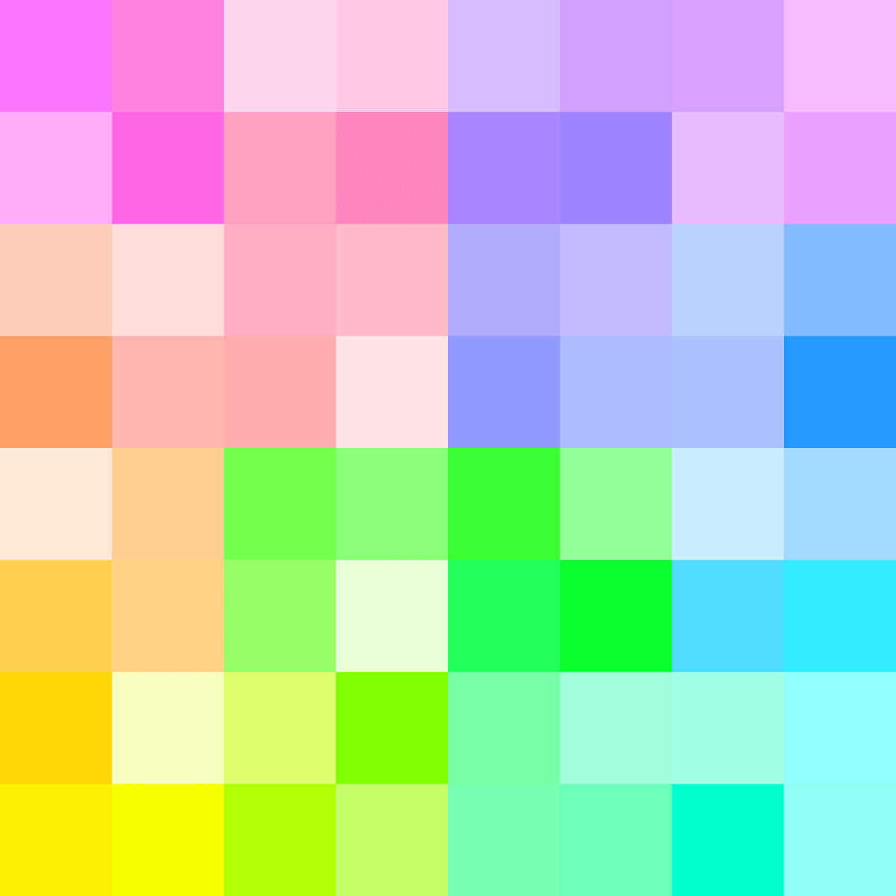
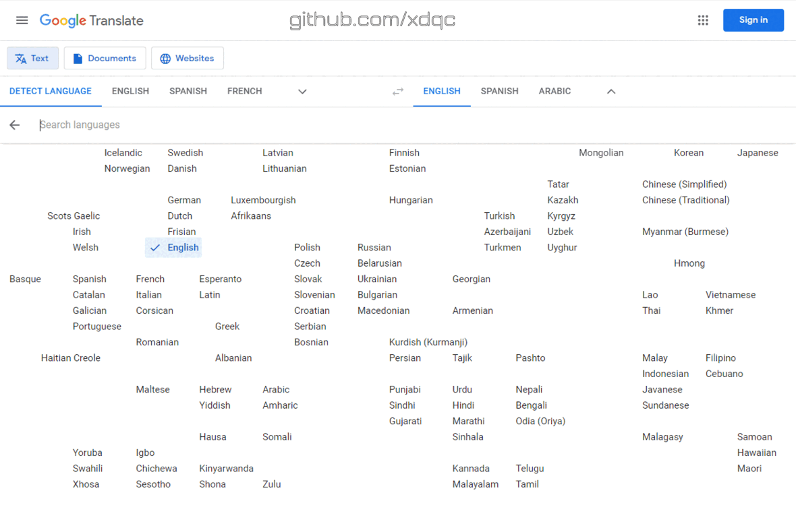

# Knowledge Bomb :bomb:

A quiz game, a brain imagery generator, an ice breaker to galvanize undercurrent ideas, an alternative to Wikipedia "random article", available in 300+ languages 🌍🌏🌎 https://www.knb.wiki

----

The game content is data mined and analysed from Wikipedia articles and Wikidata items by multiple dimensions: languages clustering, hypernyms categorization, complexity scoring, etc. 

## Hypernym Hierarchy

All qualified Wikidata items / Wikipedia articles are categorized in 64 buckets. 

The 64 top-level hypernyms of controlled vocabulary are presented for players to switch on/off to control the scopes of the next randomized quiz during game session by detonating 💣

Different views of the hypernym hierarchy:

- [Tree path](docs/hypernym-hierarchy.md#Tree-path)
- [Tree path (monospaced node)](docs/hypernym-hierarchy.md#Monospaced-tree-path)
- [Hilbert curve](docs/hypernym-hierarchy.md#Hilbert-curve)
- [Hilbert curve (monospaced node)](docs/hypernym-hierarchy.md#Monospaced-Hilbert-curve)
  - [Compact tiles](docs/hypernym-hierarchy.md#Compact-tiles)

The design principle is: gameplay first, performance second, academic last; coarsely classifying as a decision tree, instead of networking as an ontologically precise semantic graph. The tree branches are grown and pruned to achieve balanced number of items/articles per node.

### Knowledge Profile

For each game, a **knowledge profile**, or a **brain imagery**, will be generated to represent the player's mind for that quiz session. The more correct answer of the hypernym category, the more saturation of the cell color; the more wrong answer of the hypernym caterogy, the less saturation of the cell color. Example of *knowledge profile* :

## 2D language picker

The 🗺 [2D language picker](docs/lexi_map.PNG) keeps the constant position of each language no matter choosing which language to display. It solves the problem of one dimentional language pickers (re)ordering certain languages alphabetically at various positions that hard to find, e.g. *Deutsch* - _**A**leman_, _**I**naleman_, _**L**ialémani_, _**B**éésh bichʼahii_, _**C**eruman_, _**D**uits_, _**E**leman_, _**F**rangikos_, _**G**erman_, _**J**erman_, _**K**rzyżacki_, _**M**jymjecko_, _**Н**емецкий_, _**N**émet_, _**O**lmoni_, _**P**reisen_, _**R**ajchski_, _**S**aksa_, _**𐌸**𐌹𐌿𐌳𐌹𐍃𐌺𐌰𐍂𐌰𐌶𐌳𐌰_, _**Þ**ýska_, _**T**ysk_, _**U**budage_, _**V**ācu_, _**W**eimarische_, _**Y**oeraman_, _**Z**ėm_, etc.

🗺 is also availble in game as a cheatsheet (hit top menubar ⌨ for hotkeys).

[Design considerations](docs/languages-cluster.md#Design-considerations)

A lite version of the lexical distance map can be used as an convenient language picker for Google Translate:

## List of Wikipedias - Languages ranking table

English is the first language in terms of information coverage and completeness. But which language is the second, and so on? Can we order languages in a quantitative manner?

The ranking is based on numbers of [qualified Wikidata items](#Qualified-Wikidata-items) per language.
(*wonder where's the [swedish-cebuano](https://blog.datawrapper.de/wikipedia-articles-written-by-a-bot/)?*)

[Ranking methodology](docs/languages-ranking.md)

| Rank | Language(Local) | Language | Wiki | WSM | Coverage% | Q60 :1st_place_medal: | Q50 :2nd_place_medal: | Q40 :3rd_place_medal: | Q30 :medal_sports: | Q20 :medal_military: | Articles | Solidness% | Speakers |
|---|---|---|---|---|---|---|---|---|---|---|---|---|---|
| 1 | English | English | en | 9661.31 | 99.16% | 5878 | 8817 | 13943 | 23112 | 41766 | 6896745 | 4.83% | 1348000 |
| 2 | Español | Spanish | es | 9580.10 | 97.50% | 5868 | 8770 | 13786 | 22630 | 39736 | 1984288 | 16.50% | 586000 |
| 3 | Français | French | fr | 9566.99 | 97.23% | 5864 | 8752 | 13730 | 22510 | 39587 | 2641672 | 12.36% | 274000 |
| 4 | Русский | Russian | ru | 9539.45 | 96.67% | 5851 | 8746 | 13749 | 22408 | 38749 | 2004567 | 16.19% | 258000 |
| 5 | Deutsch | German | de | 9466.85 | 95.20% | 5763 | 8577 | 13439 | 21913 | 38074 | 2951069 | 10.83% | 135000 |
| 6 | Українська | Ukrainian | uk | 9464.87 | 95.16% | 5871 | 8787 | 13770 | 22116 | 36206 | 1349145 | 23.68% | 40000 |
| 7 | 中文 | Chinese | zh | 9441.68 | 94.70% | 5869 | 8788 | 13722 | 21922 | 35746 | 1447000 | 21.97% | 1120000 |
| 8 | Português | Portuguese | pt | 9424.59 | 94.36% | 5789 | 8634 | 13492 | 21788 | 36365 | 1135120 | 27.91% | 274000 |
| 9 | Italiano | Italian | it | 9402.41 | 93.91% | 5744 | 8562 | 13334 | 21536 | 36703 | 1886839 | 16.71% | 85000 |
| 10 | 日本語 | Japanese | ja | 9391.92 | 93.70% | 5826 | 8688 | 13476 | 21451 | 35328 | 1433599 | 21.94% | 128000 |
| 11 | العربية | Arabic | ar | 9373.57 | 93.34% | 5877 | 8793 | 13596 | 21427 | 34137 | 1243026 | 25.21% | 274000 |
| 12 | Nederlands | Dutch | nl | 9333.97 | 92.55% | 5841 | 8664 | 13339 | 21137 | 33833 | 2169581 | 14.32% | 30000 |
| 13 | فارسی | Persian | fa | 9326.38 | 92.40% | 5872 | 8796 | 13564 | 21111 | 32892 | 1016108 | 30.53% | 74000 |
| 14 | Català | Catalan | ca | 9317.07 | 92.22% | 5838 | 8663 | 13372 | 20991 | 33361 | 761290 | 40.67% | 10000 |
| 15 | Polski | Polish | pl | 9314.81 | 92.17% | 5740 | 8517 | 13199 | 21034 | 34214 | 1631087 | 18.97% | 45000 |
| 16 | 한국어 | Korean | ko | 9280.71 | 91.50% | 5856 | 8701 | 13397 | 20813 | 32203 | 687727 | 44.67% | 82000 |
| 17 | Svenska | Swedish | sv | 9196.05 | 89.84% | 5729 | 8484 | 13022 | 20362 | 31313 | 2596249 | 11.62% | 13000 |
| 18 | Bahasa Indonesia | Indonesian | id | 9070.28 | 87.40% | 5758 | 8510 | 12826 | 19240 | 28464 | 707545 | 41.47% | 199000 |
| 19 | Čeština | Czech | cs | 9068.74 | 87.37% | 5672 | 8375 | 12777 | 19493 | 29087 | 554980 | 52.85% | 14000 |
| 20 | Türkçe | Turkish | tr | 9041.95 | 86.85% | 5729 | 8438 | 12759 | 19161 | 27986 | 622900 | 46.81% | 88000 |
| 21 | Suomi | Finnish | fi | 9039.49 | 86.80% | 5657 | 8349 | 12696 | 19221 | 28473 | 581857 | 50.09% | 6000 |
| 22 | עברית | Hebrew | he | 8881.88 | 83.80% | 5568 | 8131 | 12131 | 18061 | 26160 | 363836 | 77.33% | 9000 |
| 23 | Norsk (Bokmål) | Norwegian (Bokmål) | no | 8847.43 | 83.15% | 5564 | 8129 | 12161 | 17975 | 25479 | 636711 | 43.85% | 5000 |
| 24 | Српски / Srpski | Serbian | sr | 8729.97 | 80.96% | 5743 | 8294 | 12007 | 16587 | 21995 | 695799 | 39.07% | 12000 |
| 25 | Esperanto | Esperanto | eo | 8685.88 | 80.14% | 5655 | 8178 | 11764 | 16337 | 21828 | 359848 | 74.77% | 180 |
|322 | [see 297 more...](docs/languages-ranking.md)  |   |   |   |   |   |   |   |   |   |   |   |   |

### Qualified Wikidata items

A qualified article ([examples](data/sample_titles.csv)) should be a general, universal, common concept or knowledge, which satisfies these criteria:

- With more than *20* languages versions.
- Not an **onomatology** (anthroponymy, toponymy, hydronym, taxon etc.), which is not a particular person, place, biota, chemical, astronomical object, company, product, publication, song, team, sport match, event, year, decade, day, unicode, etc.
- Not a disambiguation page item.
- Can be hypernyms of items above (any level of parents of `instance_of?/subclass_of*`). Hypernyms are legitimate to have less than 20 languages versions, being small quantity of abstract philosophical terms backboning the semantic network.
- Qualified item/article should be verified through with cross check and proofreading for quality assurance.

#### Use ChatGPT to decide whether a term is an onomatology

1. **Name-related**: Assess whether the term is directly related to the study of names. Onomastics focuses on names, including personal names, place names, and other types of names. If the term specifically pertains to names or their characteristics (e.g., etymology, symbolism, usage patterns), it is more likely to be associated with onomastics.

2. **Research and Study**: Determine if the term is commonly used in onomastic research and academic discourse. Look for its presence in scholarly publications, such as journals, books, or conference proceedings, that discuss the study of names. If the term is frequently employed in onomastic literature, it indicates its relevance to the field.

3. **Etymology and Linguistic Analysis**: Consider if the term involves the analysis of name origins, linguistic aspects, or phonetic and semantic variations. Onomastics often examines the etymology, phonetics, and semantics of names to understand their historical development and cultural significance. If the term involves such analyses, it aligns with onomastic interests.

4. **Cultural and Historical Context**: Evaluate whether the term relates to the cultural and historical context of names. Onomastics explores how names are influenced by cultural, social, and historical factors. If the term is associated with the cultural, social, or historical aspects of names (e.g., naming practices, name changes over time), it is more likely to be relevant to onomastics.

5. **Interdisciplinary Connections**: Consider if the term intersects with other disciplines related to names, such as linguistics, anthropology, history, sociology, or cultural studies. Onomastics often collaborates with these fields to gain insights into the study of names. If the term has connections to multiple disciplines, it strengthens its association with onomastics.

6. **Consensus within the Field**: Take into account the consensus among experts and scholars in onomastics. If the term is widely accepted and recognized by the onomastic community as relevant to the field, it can be considered part of onomatology.

ChatGPT's knowledge is based on pre-existing data and may not always reflect the latest developments in onomastics.
