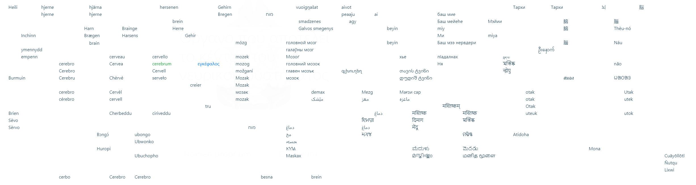

# Knowledge Bomb :bomb:

An alternative to Wikipedia "random article", a vocabulary quiz game, an undercurrent idea generator, available in 300+ languages 🌍🌏🌎 https://www.knb.wiki

## Data mining from Wikipedia

The game content is data mined and analysed from Wikipedia articles and Wikidata items by multiple dimensions: language, language count, language cluster, hypernym, hypernym category, complexity scoring, etc. 

### Hypernym Hierarchy

All Wikidata items / Wikipedia articles are categorized in buckets. The design principle is: gameplay first, performance (query speed) second, academic last; coarsely classifying as a decision tree, instead of networking as an ontologically precise semantic graph. The tree branches are grown and pruned to achieve balanced number of items/articles per node.

The 66 top-level hypernyms of controlled vocabulary are presented for players to pick during the game by detonating 💣

```
Node          Path
-----------------------------------------------------------------------------------------------------------------------
151885        Concept                                   /Concept                                                             
.468777       ├── Existence                             /Concept/Existence                                                   
..12827256    │   ├── Myth                              /Concept/Existence/Myth                                              
..7257        │   └── Ideology                          /Concept/Existence/Ideology                                          
...9174       │       └── Religion                      /Concept/Existence/Ideology/Religion                                 
.17737        ├── Theory                                /Concept/Theory                                                      
..41719       │   └── Hypothesis                        /Concept/Theory/Hypothesis                                           
.395          ├── Mathematics                           /Concept/Mathematics                                                 
..17736       │   ├── Axiom                             /Concept/Mathematics/Axiom                                           
..65943       │   ├── Theorem                           /Concept/Mathematics/Theorem                                         
..207961      │   └── Shape                             /Concept/Mathematics/Shape                                           
.35120        └── Entity                                /Concept/Entity                                                      
..11471           ├── Time                              /Concept/Entity/Time                                                 
...483247         │   ├── Phenomenon                    /Concept/Entity/Time/Phenomenon                                      
...100235738      │   ├── Event                         /Concept/Entity/Time/Event                                           
...309            │   ├── History                       /Concept/Entity/Time/History                                         
...4026292        │   ├── Action                        /Concept/Entity/Time/Action                                          
....9332          │   │   ├── Behavior                  /Concept/Entity/Time/Action/Behavior                                 
.....921513       │   │   │   ├── Social behavior       /Concept/Entity/Time/Action/Behavior/Social_behavior                 
.....11042        │   │   │   ├── Culture               /Concept/Entity/Time/Action/Behavior/Culture                         
.....349          │   │   │   ├── Sport                 /Concept/Entity/Time/Action/Behavior/Sport                           
.....11410        │   │   │   ├── Game                  /Concept/Entity/Time/Action/Behavior/Game                            
.....735          │   │   │   └── Art                   /Concept/Entity/Time/Action/Behavior/Art                             
......483394      │   │   │       └── Genre             /Concept/Entity/Time/Action/Behavior/Art/Genre                       
....2695280       │   │   └── Technique                 /Concept/Entity/Time/Action/Technique                                
...1150070        │   ├── Change                        /Concept/Entity/Time/Change                                          
....12136         │   │   └── Disease                   /Concept/Entity/Time/Change/Disease                                  
...3249551        │   └── Process                       /Concept/Entity/Time/Process                                         
..7239            ├── Organism                          /Concept/Entity/Organism                                             
...514            │   └── Anatomy                       /Concept/Entity/Organism/Anatomy                                     
..6671777         ├── Structure                         /Concept/Entity/Structure                                            
...58778          │   └── System                        /Concept/Entity/Structure/System                                     
....16887380      │       └── Group                     /Concept/Entity/Structure/System/Group                               
.....43229        │           ├── Organization          /Concept/Entity/Structure/System/Group/Organization                  
.....41710        │           └── Ethnic group          /Concept/Entity/Structure/System/Group/Ethnic_group                  
..937228          ├── Property                          /Concept/Entity/Property                                             
...930933         │   ├── Relation                      /Concept/Entity/Property/Relation                                    
...1207505        │   ├── Quality                       /Concept/Entity/Property/Quality                                     
....315           │   │   └── Language                  /Concept/Entity/Property/Quality/Language                            
...4373292        │   ├── Physical property             /Concept/Entity/Property/Physical_property                           
....2221906       │   │   └── Location                  /Concept/Entity/Property/Physical_property/Location                  
...47574          │   └── Unit of measurement           /Concept/Entity/Property/Unit_of_measurement                         
..488383          └── Object                            /Concept/Entity/Object                                               
...187931             ├── Phrase                        /Concept/Entity/Object/Phrase                                        
...11028              ├── Information                   /Concept/Entity/Object/Information                                   
....3695082           │   ├── Sign                      /Concept/Entity/Object/Information/Sign                              
....628523            │   ├── Message                   /Concept/Entity/Object/Information/Message                           
....49848             │   ├── Document                  /Concept/Entity/Object/Information/Document                          
....9081              │   └── Knowledge                 /Concept/Entity/Object/Information/Knowledge                         
.....80083            │       ├── Humanities            /Concept/Entity/Object/Information/Knowledge/Humanities              
.....336              │       └── Science               /Concept/Entity/Object/Information/Knowledge/Science                 
......11016           │           ├── Technology        /Concept/Entity/Object/Information/Knowledge/Science/Technology      
......21198           │           └── Computer science  /Concept/Entity/Object/Information/Knowledge/Science/Computer_science
...223557             └── Physical object               /Concept/Entity/Object/Physical_object                               
....35758                 ├── Matter                    /Concept/Entity/Object/Physical_object/Matter                        
....79529                 ├── Chemical substance        /Concept/Entity/Object/Physical_object/Chemical_substance            
....6999                  ├── Astronomical object       /Concept/Entity/Object/Physical_object/Astronomical_object           
....28877                 └── Goods                     /Concept/Entity/Object/Physical_object/Goods                         
.....121359                   ├── Infrastructure        /Concept/Entity/Object/Physical_object/Goods/Infrastructure          
......811979                  │   └── Architecture      /Concept/Entity/Object/Physical_object/Goods/Infrastructure/Architecture
.....39546                    ├── Tool                  /Concept/Entity/Object/Physical_object/Goods/Tool                    
......11019                   │   ├── Machine           /Concept/Entity/Object/Physical_object/Goods/Tool/Machine            
......34379                   │   └── Instrument        /Concept/Entity/Object/Physical_object/Goods/Tool/Instrument         
.....11460                    ├── Clothing              /Concept/Entity/Object/Physical_object/Goods/Clothing                
.....2095                     └── Food                  /Concept/Entity/Object/Physical_object/Goods/Food                    
......40050                       └── Drink             /Concept/Entity/Object/Physical_object/Goods/Food/Drink              

```

`Monospaced`[`path`](https://en.wiktionary.org/wiki/道#Definitions)[道](https://www.wikidata.org/wiki/Q151885)    
　　　　　　　　├[─](https://en.wiktionary.org/wiki/有#Definitions)[有](https://www.wikidata.org/wiki/Q468777)    
　　　　　　　　│　├[─](https://en.wiktionary.org/wiki/神#Definitions)[神](https://www.wikidata.org/wiki/Q12827256)    
　　　　　　　　│　└[─](https://en.wiktionary.org/wiki/意#Definitions)[意](https://www.wikidata.org/wiki/Q7257)    
　　　　　　　　│　　└[─](https://en.wiktionary.org/wiki/教#Definitions)[教](https://www.wikidata.org/wiki/Q9174)    
　　　　　　　　├[─](https://en.wiktionary.org/wiki/論#Definitions)[論](https://www.wikidata.org/wiki/Q17737)    
　　　　　　　　│　└[─](https://en.wiktionary.org/wiki/設#Definitions)[設](https://www.wikidata.org/wiki/Q41719)    
　　　　　　　　├[─](https://en.wiktionary.org/wiki/學#Definitions)[學](https://www.wikidata.org/wiki/Q395)    
　　　　　　　　│　├[─](https://en.wiktionary.org/wiki/理#Definitions)[理](https://www.wikidata.org/wiki/Q17736)    
　　　　　　　　│　├[─](https://en.wiktionary.org/wiki/則#Definitions)[則](https://www.wikidata.org/wiki/Q65943)    
　　　　　　　　│　└[─](https://en.wiktionary.org/wiki/形#Definitions)[形](https://www.wikidata.org/wiki/Q207961)    
　　　　　　　　└[─](https://en.wiktionary.org/wiki/實#Definitions)[實](https://www.wikidata.org/wiki/Q35120)    
　　　　　　　　　　├[─](https://en.wiktionary.org/wiki/時#Definitions)[時](https://www.wikidata.org/wiki/Q11471)    
　　　　　　　　　　│　├[─](https://en.wiktionary.org/wiki/象#Definitions)[象](https://www.wikidata.org/wiki/Q483247)    
　　　　　　　　　　│　├[─](https://en.wiktionary.org/wiki/事#Definitions)[事](https://www.wikidata.org/wiki/Q100235738)    
　　　　　　　　　　│　├[─](https://en.wiktionary.org/wiki/史#Definitions)[史](https://www.wikidata.org/wiki/Q309)    
　　　　　　　　　　│　├[─](https://en.wiktionary.org/wiki/動#Definitions)[動](https://www.wikidata.org/wiki/Q4026292)    
　　　　　　　　　　│　│　├[─](https://en.wiktionary.org/wiki/行#Definitions)[行](https://www.wikidata.org/wiki/Q9332)    
　　　　　　　　　　│　│　│　├[─](https://en.wiktionary.org/wiki/為#Definitions)[為](https://www.wikidata.org/wiki/Q921513)    
　　　　　　　　　　│　│　│　├[─](https://en.wiktionary.org/wiki/文#Definitions)[文](https://www.wikidata.org/wiki/Q11042)    
　　　　　　　　　　│　│　│　├[─](https://en.wiktionary.org/wiki/健#Definitions)[健](https://www.wikidata.org/wiki/Q349)    
　　　　　　　　　　│　│　│　├[─](https://en.wiktionary.org/wiki/戲#Definitions)[戲](https://www.wikidata.org/wiki/Q11410)    
　　　　　　　　　　│　│　│　└[─](https://en.wiktionary.org/wiki/藝#Definitions)[藝](https://www.wikidata.org/wiki/Q735)    
　　　　　　　　　　│　│　│　　└[─](https://en.wiktionary.org/wiki/風#Definitions)[風](https://www.wikidata.org/wiki/Q483394)    
　　　　　　　　　　│　│　└[─](https://en.wiktionary.org/wiki/技#Definitions)[技](https://www.wikidata.org/wiki/Q2695280)    
　　　　　　　　　　│　├[─](https://en.wiktionary.org/wiki/變#Definitions)[變](https://www.wikidata.org/wiki/Q1150070)    
　　　　　　　　　　│　│　└[─](https://en.wiktionary.org/wiki/疾#Definitions)[疾](https://www.wikidata.org/wiki/Q12136)    
　　　　　　　　　　│　└[─](https://en.wiktionary.org/wiki/程#Definitions)[程](https://www.wikidata.org/wiki/Q3249551)    
　　　　　　　　　　├[─](https://en.wiktionary.org/wiki/生#Definitions)[生](https://www.wikidata.org/wiki/Q7239)    
　　　　　　　　　　│　└[─](https://en.wiktionary.org/wiki/解#Definitions)[解](https://www.wikidata.org/wiki/Q514)    
　　　　　　　　　　├[─](https://en.wiktionary.org/wiki/構#Definitions)[構](https://www.wikidata.org/wiki/Q6671777)    
　　　　　　　　　　│　└[─](https://en.wiktionary.org/wiki/系#Definitions)[系](https://www.wikidata.org/wiki/Q58778)    
　　　　　　　　　　│　　　└[─](https://en.wiktionary.org/wiki/群#Definitions)[群](https://www.wikidata.org/wiki/Q16887380)    
　　　　　　　　　　│　　　　├[─](https://en.wiktionary.org/wiki/組#Definitions)[組](https://www.wikidata.org/wiki/Q43229)    
　　　　　　　　　　│　　　　└[─](https://en.wiktionary.org/wiki/族#Definitions)[族](https://www.wikidata.org/wiki/Q41710)    
　　　　　　　　　　├[─](https://en.wiktionary.org/wiki/性#Definitions)[性](https://www.wikidata.org/wiki/Q937228)    
　　　　　　　　　　│　├[─](https://en.wiktionary.org/wiki/關#Definitions)[關](https://www.wikidata.org/wiki/Q930933)    
　　　　　　　　　　│　├[─](https://en.wiktionary.org/wiki/品#Definitions)[品](https://www.wikidata.org/wiki/Q1207505)    
　　　　　　　　　　│　│　└[─](https://en.wiktionary.org/wiki/語#Definitions)[語](https://www.wikidata.org/wiki/Q315)    
　　　　　　　　　　│　├[─](https://en.wiktionary.org/wiki/質#Definitions)[質](https://www.wikidata.org/wiki/Q4373292)    
　　　　　　　　　　│　│　└[─](https://en.wiktionary.org/wiki/輿#Definitions)[輿](https://www.wikidata.org/wiki/Q2221906)    
　　　　　　　　　　│　└[─](https://en.wiktionary.org/wiki/衡#Definitions)[衡](https://www.wikidata.org/wiki/Q47574)    
　　　　　　　　　　└[─](https://en.wiktionary.org/wiki/彼#Definitions)[彼](https://www.wikidata.org/wiki/Q488383)    
　　　　　　　　　　　├[─](https://en.wiktionary.org/wiki/言#Definitions)[言](https://www.wikidata.org/wiki/Q187931)    
　　　　　　　　　　　├[─](https://en.wiktionary.org/wiki/信#Definitions)[信](https://www.wikidata.org/wiki/Q11028)    
　　　　　　　　　　　│　├[─](https://en.wiktionary.org/wiki/記#Definitions)[記](https://www.wikidata.org/wiki/Q3695082)    
　　　　　　　　　　　│　├[─](https://en.wiktionary.org/wiki/訊#Definitions)[訊](https://www.wikidata.org/wiki/Q628523)    
　　　　　　　　　　　│　├[─](https://en.wiktionary.org/wiki/書#Definitions)[書](https://www.wikidata.org/wiki/Q49848)    
　　　　　　　　　　　│　└[─](https://en.wiktionary.org/wiki/知#Definitions)[知](https://www.wikidata.org/wiki/Q9081)    
　　　　　　　　　　　│　　　├[─](https://en.wiktionary.org/wiki/倫#Definitions)[倫](https://www.wikidata.org/wiki/Q80083)    
　　　　　　　　　　　│　　　└[─](https://en.wiktionary.org/wiki/格#Definitions)[格](https://www.wikidata.org/wiki/Q336)    
　　　　　　　　　　　│　　　　　├[─](https://en.wiktionary.org/wiki/工#Definitions)[工](https://www.wikidata.org/wiki/Q11016)    
　　　　　　　　　　　│　　　　　└[─](https://en.wiktionary.org/wiki/計#Definitions)[計](https://www.wikidata.org/wiki/Q21198)    
　　　　　　　　　　　└[─](https://en.wiktionary.org/wiki/物#Definitions)[物](https://www.wikidata.org/wiki/Q223557)    
　　　　　　　　　　　　　├[─](https://en.wiktionary.org/wiki/粒#Definitions)[粒](https://www.wikidata.org/wiki/Q35758)    
　　　　　　　　　　　　　├[─](https://en.wiktionary.org/wiki/素#Definitions)[素](https://www.wikidata.org/wiki/Q79529)    
　　　　　　　　　　　　　├[─](https://en.wiktionary.org/wiki/星#Definitions)[星](https://www.wikidata.org/wiki/Q6999)    
　　　　　　　　　　　　　└[─](https://en.wiktionary.org/wiki/貨#Definitions)[貨](https://www.wikidata.org/wiki/Q28877)    
　　　　　　　　　　　　　　├[─](https://en.wiktionary.org/wiki/建#Definitions)[建](https://www.wikidata.org/wiki/Q121359)    
　　　　　　　　　　　　　　│　└[─](https://en.wiktionary.org/wiki/築#Definitions)[築](https://www.wikidata.org/wiki/Q811979)    
　　　　　　　　　　　　　　├[─](https://en.wiktionary.org/wiki/具#Definitions)[具](https://www.wikidata.org/wiki/Q39546)    
　　　　　　　　　　　　　　│　├[─](https://en.wiktionary.org/wiki/械#Definitions)[械](https://www.wikidata.org/wiki/Q11019)    
　　　　　　　　　　　　　　│　└[─](https://en.wiktionary.org/wiki/器#Definitions)[器](https://www.wikidata.org/wiki/Q34379)    
　　　　　　　　　　　　　　├[─](https://en.wiktionary.org/wiki/衣#Definitions)[衣](https://www.wikidata.org/wiki/Q11460)    
　　　　　　　　　　　　　　└[─](https://en.wiktionary.org/wiki/食#Definitions)[食](https://www.wikidata.org/wiki/Q2095)    
　　　　　　　　　　　　　　　　└[─](https://en.wiktionary.org/wiki/飲#Definitions)[飲](https://www.wikidata.org/wiki/Q40050)    


### 2D Language picker

The 🗺 [2D language picker](docs/lexi_map.PNG) keeps the constant position of each language no matter choosing which language to display. It solves the problem of one dimentional language pickers (re)ordering certain languages alphabetically at various positions that hard to find, e.g. *Deutsche* - _**A**leman_, _**I**naleman_, _**L**ialémani_, _**B**éésh bichʼahii_, _**C**eruman_, _**D**uits_, _**E**leman_, _**F**rangikos_, _**G**erman_, _**J**erman_, _**K**rzyżacki_, _**M**jymjecko_, _**Н**емецкий_, _**N**émet_, _**O**lmoni_, _**P**reisen_, _**R**ajchski_, _**S**aksa_, _**𐌸**𐌹𐌿𐌳𐌹𐍃𐌺𐌰𐍂𐌰𐌶𐌳𐌰_, _**Þ**ýska_, _**T**ysk_, _**U**budage_, _**V**ācu_, _**W**eimarische_, _**Y**oeraman_, _**Z**ėm_, etc.

[](docs/lexi_map.PNG)

🗺 is also availble in game as a cheatsheet (hit top menubar ⌨ for hotkeys).

Design considerations:

  1. Easy to pick - align to grid
  2. Language lineage lead - Afrikaans, ייִדיש are placed at West Germanic blob
  3. Respect relative geolocation inter- and in- blobs
  4. Major languages at the top or bottom of blobs that quick to be found
  5. Extinct languages next to major languages - Classical Chinese, Aramaic, Sanskrit, Latin, Gothic, Ænglisc
  6. Isolated languages look isolated - Basque, Greek, Albanian, Armenian, Chuvash, etc.
  7. Screen real estate - no overlapping in most languages on 1300px minimum width
  8. Background image is only for decoration


### List of Wikipedias - Languages ranking table

Ranking is based on numbers of [qualified Wikidata items](#Qualified-Wikidata-items) per language.
(*wonder where's the swedish cebuano?*)

  - **`Q60`** is the number of qualified wikipedia articles with more than *60* language versions, so as `Q50` `Q40` `Q30` `Q20`.
  - **`WSM`**, weighted sum model, is the square root of sum of squares of language_versions_count of all qualified articles of the language.
  - **`Coverage%`**<sup>[‡](#notes)</sup> is the language WSM to English WSM ratio<sup>[†](#notes)</sup>
  - **`Articles`** is total [number of Wikipedia articles by language](https://meta.wikimedia.org/wiki/List_of_Wikipedias).
  - **`Solidness%`** is WSM to article ratio, using simple_english as 100% benchmark. Higher solidness means less proportion of trivial articles of that language.
  - **`Speakers`** is L1+L2 speakers of the language in thousand (source: wikipedia of each language).

| Rank | Language(Local) | Language | Wiki | Coverage% | Q60 :1st_place_medal: | Q50 :2nd_place_medal: | Q40 :3rd_place_medal: | Q30 :medal_sports: | Q20 :medal_military: | WSM | Articles | Solidness% | Speakers |
|---|---:|---|---|---:|---:|---:|---:|---:|---:|---:|---:|---:|---:|
| 1 | English | English | en | 100.00% | 5265 | 7845 | 12532 | 20969 | 38482 | 9080.18 | 6424700 | 4.07% | 1348000 |
| 2 | Español | Spanish | es | 98.17% | 5254 | 7798 | 12383 | 20511 | 36588 | 8996.87 | 1738225 | 14.77% | 586000 |
| 3 | Français | French | fr | 97.96% | 5242 | 7787 | 12348 | 20427 | 36468 | 8987.09 | 2381920 | 10.76% | 274000 |
| 4 | Русский | Russian | ru | 97.59% | 5251 | 7805 | 12401 | 20385 | 35823 | 8970.06 | 1779001 | 14.35% | 258000 |
| 5 | Deutsch | German | de | 95.89% | 5150 | 7623 | 12080 | 19913 | 35258 | 8891.75 | 2643273 | 9.49% | 135000 |
| 6 | Українська | Ukrainian | uk | 95.52% | 5259 | 7827 | 12397 | 20009 | 33019 | 8874.50 | 1128056 | 22.15% | 40000 |
| 7 | Português | Portuguese | pt | 94.92% | 5174 | 7673 | 12136 | 19753 | 33533 | 8846.33 | 1078928 | 23.01% | 274000 |
| 8 | Italiano | Italian | it | 94.84% | 5155 | 7638 | 12053 | 19634 | 34073 | 8842.92 | 1730998 | 14.33% | 85000 |
| 9 | 中文 | Chinese | zh | 94.72% | 5250 | 7792 | 12276 | 19708 | 32463 | 8837.26 | 1245720 | 19.89% | 1120000 |
| 10 | 日本語 | Japanese | ja | 94.47% | 5230 | 7744 | 12165 | 19558 | 32699 | 8825.35 | 1305277 | 18.93% | 128000 |
| 11 | Nederlands | Dutch | nl | 93.65% | 5257 | 7742 | 12093 | 19339 | 31590 | 8787.27 | 2074259 | 11.81% | 30000 |
| 12 | العربية | Arabic | ar | 93.16% | 5262 | 7806 | 12150 | 19203 | 30778 | 8764.37 | 1149073 | 21.20% | 274000 |
| 13 | Polski | Polish | pl | 93.05% | 5141 | 7575 | 11937 | 19269 | 32035 | 8758.93 | 1500377 | 16.22% | 45000 |
| 14 | Català | Catalan | ca | 92.74% | 5214 | 7705 | 12050 | 19125 | 30748 | 8744.42 | 692111 | 35.05% | 10000 |
| 15 | فارسی | Persian | fa | 91.96% | 5263 | 7835 | 12141 | 18866 | 29321 | 8707.67 | 849228 | 28.32% | 74000 |
| 16 | 한국어 | Korean | ko | 90.98% | 5237 | 7721 | 11941 | 18585 | 28811 | 8661.02 | 569320 | 41.79% | 82000 |
| 17 | Svenska | Swedish | sv | 90.92% | 5132 | 7565 | 11820 | 18696 | 29433 | 8658.00 | 2820221 | 8.43% | 13000 |
| 18 | Čeština | Czech | cs | 88.35% | 5097 | 7488 | 11591 | 17926 | 27213 | 8534.71 | 493744 | 46.80% | 14000 |
| 19 | Suomi | Finnish | fi | 87.43% | 5071 | 7451 | 11493 | 17617 | 26438 | 8490.23 | 521190 | 43.87% | 6000 |
| 20 | Bahasa Indonesia | Indonesian | id | 86.51% | 5140 | 7513 | 11406 | 17079 | 25379 | 8445.50 | 608149 | 37.20% | 199000 |
| 21 | Türkçe | Turkish | tr | 85.73% | 5084 | 7428 | 11283 | 16989 | 24877 | 8407.55 | 461700 | 48.56% | 88000 |
| 22 | Norsk (Bokmål) | Norwegian (Bokmål) | no | 84.24% | 5022 | 7294 | 11088 | 16654 | 24082 | 8334.09 | 572167 | 38.51% | 5000 |
| 23 | עברית | Hebrew | he | 83.53% | 4965 | 7206 | 10871 | 16286 | 23866 | 8298.69 | 307833 | 70.97% | 9000 |
| 24 | Српски / Srpski | Serbian | sr | 81.16% | 5145 | 7432 | 10886 | 15200 | 20230 | 8180.39 | 652901 | 32.51% | 12000 |
| 25 | Esperanto | Esperanto | eo | 80.46% | 5074 | 7278 | 10668 | 14974 | 20333 | 8145.04 | 308208 | 68.28% | 180 |
| 26 | Tiếng Việt | Vietnamese | vi | 79.32% | 5036 | 7149 | 10274 | 14467 | 20065 | 8086.87 | 1269556 | 16.34% | 77000 |
| 27 | Български | Bulgarian | bg | 78.28% | 5017 | 7193 | 10416 | 14371 | 18768 | 8033.99 | 277631 | 73.75% | 8000 |
| 28 | Euskara | Basque | eu | 77.73% | 5041 | 7159 | 10227 | 13991 | 18249 | 8005.40 | 384549 | 52.86% | 1000 |
| 29 | Dansk | Danish | da | 77.57% | 4834 | 6900 | 10121 | 14378 | 19484 | 7997.28 | 271149 | 74.82% | 6000 |
| 30 | Română | Romanian | ro | 77.06% | 4927 | 6982 | 10079 | 13965 | 18518 | 7970.84 | 425577 | 47.36% | 29000 |
| 31 | Simple English | Simple English | simple | 76.51% | 4936 | 7004 | 9988 | 13709 | 18048 | 7942.68 | 200113 | 100.00% |   |
| 32 | Eesti | Estonian | et | 75.04% | 4810 | 6769 | 9692 | 13390 | 17637 | 7865.64 | 223711 | 87.72% | 1000 |
| 33 | Magyar | Hungarian | hu | 74.25% | 4606 | 6503 | 9464 | 13413 | 18625 | 7824.22 | 496492 | 39.11% | 13000 |
| 34 | Hrvatski | Croatian | hr | 72.97% | 4827 | 6705 | 9366 | 12527 | 15979 | 7756.38 | 209767 | 90.97% | 6000 |
| 35 | Ελληνικά | Greek | el | 70.93% | 4628 | 6408 | 8902 | 11977 | 15511 | 7647.42 | 201936 | 91.87% | 14000 |
| 36 | Srpskohrvatski / Српскохрватски | Serbo-Croatian | sh | 70.55% | 4708 | 6431 | 8887 | 11699 | 14892 | 7626.93 | 455943 | 40.47% | 21000 |
| 37 | Galego | Galician | gl | 69.54% | 4674 | 6326 | 8663 | 11304 | 14396 | 7571.83 | 178381 | 101.95% | 2000 |
| 38 | Lietuvių | Lithuanian | lt | 69.45% | 4596 | 6310 | 8693 | 11513 | 14650 | 7567.39 | 200957 | 90.39% | 3000 |
| 39 | Slovenčina | Slovak | sk | 68.98% | 4489 | 6234 | 8678 | 11628 | 14873 | 7541.52 | 238430 | 75.67% | 5000 |
| 40 | Հայերեն | Armenian | hy | 67.91% | 4415 | 6036 | 8356 | 11340 | 14713 | 7482.69 | 289507 | 61.35% | 7000 |
| 41 | ไทย | Thai | th | 66.72% | 4398 | 5920 | 8047 | 10709 | 13877 | 7416.79 | 144431 | 120.81% | 61000 |
| 42 | 粵語 | Cantonese | zh-yue | 66.15% | 4655 | 6072 | 7819 | 9833 | 12232 | 7385.08 | 121421 | 142.48% | 85000 |
| 43 | Bahasa Melayu | Malay | ms | 65.79% | 4398 | 5913 | 7884 | 10335 | 13039 | 7365.20 | 355532 | 48.40% | 200000 |
| 44 | Slovenščina | Slovenian | sl | 65.35% | 4219 | 5800 | 7970 | 10570 | 13578 | 7340.44 | 174487 | 97.95% | 2000 |
| 45 | Беларуская | Belarusian | be | 64.94% | 4392 | 5789 | 7714 | 9971 | 12607 | 7317.44 | 212460 | 79.94% | 11000 |
| 46 | Azərbaycanca | Azerbaijani | az | 63.46% | 4237 | 5674 | 7627 | 9773 | 12255 | 7233.37 | 180871 | 91.76% | 23000 |
| 47 | Nynorsk | Norwegian (Nynorsk) | nn | 62.76% | 4177 | 5510 | 7386 | 9523 | 11823 | 7193.51 | 160808 | 102.07% | 5000 |
| 48 | हिन्दी | Hindi | hi | 61.98% | 4125 | 5490 | 7296 | 9383 | 11731 | 7148.77 | 151384 | 107.08% | 600000 |
| 49 | தமிழ் | Tamil | ta | 61.67% | 4175 | 5462 | 7086 | 8971 | 11164 | 7130.58 | 142992 | 112.79% | 85000 |
| 50 | Latviešu | Latvian | lv | 61.60% | 4553 | 5639 | 6884 | 8136 | 9375 | 7126.60 | 110030 | 146.42% | 2000 |
| 51 | 吴语 | Wu | wuu | 61.01% | 5188 | 6114 | 6626 | 7183 | 7746 | 7092.27 | 42662 | 374.00% | 82000 |
| 52 | Македонски | Macedonian | mk | 58.57% | 3936 | 5158 | 6716 | 8396 | 10177 | 6949.15 | 121484 | 126.09% | 2000 |
| 53 | Қазақша | Kazakh | kk | 57.91% | 3786 | 5048 | 6718 | 8605 | 10698 | 6909.66 | 230349 | 65.75% | 19000 |
| 54 | Latina | Latin | la | 56.52% | 3895 | 4832 | 6036 | 7407 | 8996 | 6826.56 | 136494 | 108.30% |   |
| 55 | Asturianu | Asturian | ast | 56.33% | 3890 | 4993 | 6206 | 7439 | 8715 | 6815.10 | 128538 | 114.62% | 1000 |
| 56 | বাংলা | Bengali | bn | 55.71% | 3694 | 4776 | 6166 | 7646 | 9400 | 6777.13 | 115782 | 125.83% | 268000 |
| 57 | ქართული | Georgian | ka | 54.48% | 3609 | 4693 | 6022 | 7658 | 9332 | 6701.92 | 158012 | 90.17% | 4000 |
| 58 | Afrikaans | Afrikaans | af | 54.17% | 3695 | 4636 | 5819 | 6962 | 8123 | 6683.13 | 101322 | 139.83% | 17500 |
| 59 | اردو | Urdu | ur | 52.83% | 3540 | 4377 | 5472 | 6684 | 8092 | 6599.84 | 166424 | 83.02% | 230000 |
| 60 | Íslenska | Icelandic | is | 52.36% | 3523 | 4393 | 5423 | 6508 | 7548 | 6570.41 | 53583 | 255.56% | 314 |
| 61 | Bosanski | Bosnian | bs | 51.56% | 3446 | 4364 | 5410 | 6592 | 7759 | 6519.99 | 88754 | 151.93% | 2500 |
| 62 | മലയാളം | Malayalam | ml | 50.91% | 3381 | 4207 | 5255 | 6434 | 7727 | 6478.59 | 76873 | 173.19% | 35000 |
| 63 | Gaeilge | Irish | ga | 49.16% | 3320 | 4133 | 5128 | 6087 | 6977 | 6366.35 | 55923 | 229.90% | 658 |
| 64 | Cymraeg | Welsh | cy | 48.14% | 3220 | 3890 | 4658 | 5475 | 6226 | 6300.13 | 134076 | 93.91% | 1000 |
| 65 | Tagalog | Tagalog | tl | 46.91% | 3077 | 3727 | 4520 | 5351 | 6193 | 6219.04 | 42899 | 285.98% | 65000 |
| 66 | O‘zbek | Uzbek | uz | 46.61% | 3055 | 3818 | 4760 | 5754 | 6714 | 6199.34 | 138472 | 88.04% | 34000 |
| 67 | Беларуская (тарашкевіца) | Belarusian (Taraškievica) | be-tarask | 46.44% | 3043 | 3641 | 4403 | 5213 | 6012 | 6187.88 | 76740 | 158.27% | 11000 |
| 68 | Occitan | Occitan | oc | 45.67% | 3032 | 3613 | 4308 | 4930 | 5512 | 6136.38 | 87055 | 137.21% | 1000 |
| 69 | Shqip | Albanian | sq | 44.39% | 2847 | 3498 | 4214 | 4923 | 5688 | 6049.84 | 84194 | 137.89% | 7000 |
| 70 | Bân-lâm-gú | Min Nan | zh-min-nan | 43.08% | 2728 | 3233 | 3802 | 4357 | 4952 | 5960.04 | 430979 | 26.14% | 49000 |
| 71 | Кыргызча | Kirghiz | ky | 41.09% | 2615 | 3269 | 4081 | 4943 | 5726 | 5820.63 | 81207 | 132.34% | 4000 |
| 72 | ਪੰਜਾਬੀ | Punjabi | pa | 41.00% | 2608 | 3050 | 3535 | 4052 | 4623 | 5814.23 | 36868 | 290.85% | 52000 |
| 73 | Brezhoneg | Breton | br | 40.78% | 2460 | 2976 | 3699 | 4429 | 5330 | 5798.40 | 70418 | 151.45% | 230 |
| 74 | Kiswahili | Swahili | sw | 40.36% | 2520 | 2889 | 3295 | 3657 | 4074 | 5768.87 | 68649 | 153.78% | 69000 |
| 75 | Soranî / کوردی | Sorani | ckb | 40.30% | 2520 | 2993 | 3536 | 4067 | 4609 | 5764.07 | 35243 | 299.04% | 8000 |
| 76 | Basa Jawa | Javanese | jv | 38.42% | 2314 | 2771 | 3289 | 3955 | 4883 | 5627.99 | 64600 | 155.53% | 68000 |
| 77 | Ido | Ido | io | 38.11% | 2353 | 2852 | 3482 | 4141 | 4783 | 5605.82 | 30957 | 322.00% | 3 |
| 78 | Winaray | Waray-Waray | war | 37.66% | 2381 | 2601 | 2779 | 2973 | 3121 | 5572.05 | 1265603 | 7.78% | 4000 |
| 79 | شاہ مکھی پنجابی (Shāhmukhī Pañjābī) | Western Punjabi | pnb | 37.02% | 2166 | 2489 | 2859 | 3304 | 3824 | 5524.41 | 64173 | 150.86% | 65000 |
| 80 | मराठी | Marathi | mr | 36.18% | 2162 | 2497 | 2843 | 3207 | 3651 | 5461.55 | 82156 | 115.17% | 99000 |
| 81 | ಕನ್ನಡ | Kannada | kn | 35.90% | 2221 | 2675 | 3135 | 3624 | 4206 | 5440.81 | 27613 | 340.06% | 59000 |
| 82 | Frysk | West Frisian | fy | 35.84% | 2142 | 2579 | 3121 | 3678 | 4321 | 5436.05 | 47265 | 198.32% | 470 |
| 83 | Aragonés | Aragonese | an | 34.41% | 1944 | 2213 | 2521 | 2825 | 3124 | 5326.06 | 40795 | 220.57% | 60 |
| 84 | Scots | Scots | sco | 34.01% | 2146 | 2521 | 2752 | 2914 | 3104 | 5295.70 | 40484 | 219.74% | 1541 |
| 85 | Tatarça / Татарча | Tatar | tt | 33.63% | 1960 | 2260 | 2625 | 2996 | 3388 | 5265.71 | 321086 | 27.39% | 5000 |
| 86 | తెలుగు | Telugu | te | 33.57% | 2007 | 2354 | 2744 | 3146 | 3633 | 5261.25 | 74243 | 118.27% | 96000 |
| 87 | ייִדיש | Yiddish | yi | 33.06% | 1866 | 2069 | 2282 | 2492 | 2686 | 5221.01 | 15306 | 564.92% | 1500 |
| 88 | Interlingua | Interlingua | ia | 32.56% | 1889 | 2161 | 2464 | 2722 | 2975 | 5180.97 | 23403 | 363.82% | 2 |
| 89 | Чăваш | Chuvash | cv | 32.36% | 1944 | 2287 | 2713 | 3177 | 3633 | 5165.00 | 47284 | 178.96% | 1000 |
| 90 | Тоҷикӣ | Tajik | tg | 31.61% | 1841 | 2184 | 2542 | 2922 | 3318 | 5105.49 | 105232 | 78.57% | 8000 |
| 91 | မြန်မာဘာသာ | Burmese | my | 31.59% | 1828 | 2108 | 2452 | 2766 | 3126 | 5103.70 | 102843 | 80.34% | 43000 |
| 92 | Kurdî / كوردی | Kurdish | ku | 31.18% | 1804 | 2049 | 2310 | 2557 | 2793 | 5069.92 | 50261 | 162.22% | 30000 |
| 93 | Alemannisch | Alemannic | als | 31.04% | 1695 | 1955 | 2289 | 2570 | 2906 | 5058.62 | 28194 | 287.90% | 7000 |
| 94 | Sicilianu | Sicilian | scn | 30.82% | 1773 | 2009 | 2322 | 2589 | 2860 | 5041.17 | 26199 | 307.69% | 5000 |
| 95 | Башҡорт | Bashkir | ba | 30.46% | 1639 | 1870 | 2096 | 2356 | 2645 | 5011.50 | 59055 | 134.90% | 1000 |
| 96 | Lëtzebuergesch | Luxembourgish | lb | 29.32% | 1680 | 2045 | 2502 | 3014 | 3569 | 4916.95 | 60393 | 126.98% | 1000 |
| 97 | مصرى (Maṣri) | Egyptian Arabic | arz | 28.95% | 1646 | 1965 | 2299 | 2699 | 3242 | 4885.76 | 1475069 | 5.13% | 70000 |
| 98 | Runa Simi | Quechua | qu | 28.79% | 1578 | 1717 | 1828 | 1921 | 1990 | 4871.86 | 22943 | 328.16% | 15000 |
| 99 | Монгол | Mongolian | mn | 28.02% | 1548 | 1802 | 2056 | 2317 | 2570 | 4806.58 | 20934 | 350.08% | 5000 |
| 100 | تۆرکجه | South Azerbaijani | azb | 27.71% | 1508 | 1711 | 1929 | 2120 | 2316 | 4780.11 | 241109 | 30.06% | 13000 |
| 101 | Limburgs | Limburgish | li | 27.54% | 1472 | 1629 | 1790 | 1987 | 2147 | 4765.20 | 13553 | 531.46% | 1300 |
| 102 | नेपाली | Nepali | ne | 27.43% | 1491 | 1692 | 1937 | 2184 | 2482 | 4755.88 | 31970 | 224.42% | 16000 |
| 103 | සිංහල | Sinhalese | si | 27.05% | 1584 | 1877 | 2173 | 2509 | 2911 | 4722.21 | 17565 | 402.70% | 20000 |
| 104 | Basa Sunda | Sundanese | su | 26.63% | 1469 | 1668 | 1879 | 2094 | 2312 | 4685.83 | 61028 | 114.13% | 42000 |
| 105 | Lumbaart | Lombard | lmo | 26.59% | 1384 | 1641 | 1982 | 2334 | 2714 | 4682.64 | 50088 | 138.86% | 4000 |
| 106 | Krèyol ayisyen | Haitian | ht | 24.91% | 1368 | 1565 | 1752 | 1920 | 2049 | 4532.26 | 63671 | 102.34% | 10000 |
| 107 | მარგალური | Mingrelian | xmf | 24.15% | 1293 | 1429 | 1566 | 1695 | 1794 | 4462.55 | 18698 | 337.84% | 340 |
| 108 | Žemaitėška | Samogitian | bat-smg | 23.26% | 1062 | 1143 | 1237 | 1313 | 1414 | 4379.10 | 16967 | 358.51% | 400 |
| 109 | Malagasy | Malagasy | mg | 23.26% | 1150 | 1284 | 1446 | 1624 | 1841 | 4378.94 | 94457 | 64.39% | 25000 |
| 110 | Vèneto | Venetian | vec | 22.96% | 1116 | 1268 | 1460 | 1670 | 1882 | 4351.21 | 68877 | 87.19% | 3900 |
| 111 | سندھی ، सिन्ध | Sindhi | sd | 22.59% | 1193 | 1347 | 1523 | 1716 | 1927 | 4315.70 | 14840 | 398.12% | 32000 |
| 112 | Zazaki | Zazaki | diq | 22.33% | 1137 | 1287 | 1459 | 1638 | 1769 | 4290.83 | 40083 | 145.70% | 1340 |
| 113 | Gàidhlig | Scottish Gaelic | gd | 22.24% | 1111 | 1220 | 1337 | 1436 | 1535 | 4282.34 | 15546 | 374.18% | 150 |
| 114 | Plattdüütsch | Low Saxon | nds | 22.11% | 1158 | 1339 | 1565 | 1790 | 2072 | 4269.20 | 82929 | 69.72% | 10000 |
| 115 | Русиньскый | Rusyn | rue | 21.94% | 1031 | 1128 | 1216 | 1293 | 1362 | 4252.82 | 8256 | 694.91% | 630 |
| 116 | Саха тыла | Sakha | sah | 21.93% | 1057 | 1153 | 1252 | 1329 | 1435 | 4251.85 | 13511 | 424.43% | 450 |
| 117 | Walon | Walloon | wa | 21.69% | 1108 | 1254 | 1409 | 1550 | 1704 | 4228.89 | 11324 | 500.95% | 900 |
| 118 | پښتو | Pashto | ps | 21.61% | 1081 | 1202 | 1354 | 1503 | 1647 | 4220.76 | 12838 | 440.17% | 50000 |
| 119 | Boarisch | Bavarian | bar | 21.55% | 1099 | 1259 | 1453 | 1668 | 1945 | 4215.41 | 31769 | 177.43% | 14000 |
| 120 | नेपाल भाषा | Newar | new | 21.37% | 990 | 1062 | 1169 | 1277 | 1397 | 4197.54 | 72356 | 77.24% | 860 |
| 121 | Soomaali | Somali | so | 21.25% | 1033 | 1160 | 1273 | 1379 | 1497 | 4185.72 | 7319 | 759.33% | 22000 |
| 122 | አማርኛ | Amharic | am | 20.76% | 878 | 960 | 1025 | 1110 | 1197 | 4136.86 | 15012 | 361.61% | 57000 |
| 123 | Nordfriisk | North Frisian | frr | 19.72% | 946 | 1040 | 1125 | 1201 | 1269 | 4032.44 | 14542 | 354.69% | 10 |
| 124 | Hak-kâ-fa / 客家話 | Hakka | hak | 19.71% | 889 | 949 | 1031 | 1123 | 1215 | 4031.68 | 9424 | 547.11% | 44000 |
| 125 | Lingua franca nova | Lingua Franca Nova | lfn | 19.57% | 1051 | 1190 | 1340 | 1507 | 1691 | 4016.99 | 4147 | 1,234.26% | 1 |
| 126 | অসমীয়া | Assamese | as | 19.36% | 917 | 1004 | 1109 | 1211 | 1366 | 3995.02 | 9831 | 514.97% | 15000 |
| 127 | Ilokano | Ilokano | ilo | 19.32% | 754 | 786 | 829 | 872 | 936 | 3991.36 | 15348 | 329.25% | 10000 |
| 128 |  Mìng-dĕ̤ng-ngṳ̄ | Min Dong | cdo | 18.82% | 849 | 912 | 987 | 1064 | 1151 | 3938.75 | 15512 | 317.24% | 10000 |
| 129 | Нохчийн | Chechen | ce | 18.77% | 827 | 914 | 998 | 1082 | 1171 | 3934.08 | 453922 | 10.82% | 2000 |
| 130 | भोजपुरी | Bhojpuri | bh | 18.24% | 826 | 941 | 1055 | 1171 | 1297 | 3877.89 | 7610 | 626.83% | 52000 |
| 131 | Avañeʼẽ | Guarani | gn | 17.96% | 746 | 811 | 863 | 898 | 921 | 3848.11 | 4614 | 1,018.02% | 7000 |
| 132 | Võro | Võro | fiu-vro | 17.54% | 721 | 756 | 796 | 835 | 872 | 3802.79 | 5984 | 766.57% | 87 |
| 133 | Føroyskt | Faroese | fo | 17.17% | 776 | 833 | 882 | 934 | 969 | 3762.17 | 13647 | 328.99% | 72 |
| 134 | 古文 / 文言文 | Classical Chinese | zh-classical | 17.16% | 825 | 951 | 1098 | 1246 | 1434 | 3761.55 | 11120 | 403.62% |   |
| 135 | Piemontèis | Piedmontese | pms | 17.07% | 873 | 973 | 1117 | 1259 | 1419 | 3751.28 | 65885 | 67.75% | 2000 |
| 136 | Kriyòl Gwiyannen | Guianan Creole | gcr | 16.80% | 703 | 728 | 743 | 753 | 761 | 3721.99 | 1048 | 4,193.05% | 300 |
| 137 | chiShona | Shona | sn | 16.51% | 763 | 832 | 886 | 947 | 984 | 3689.13 | 7448 | 579.63% | 15000 |
| 138 | ગુજરાતી | Gujarati | gu | 16.24% | 824 | 914 | 1024 | 1154 | 1304 | 3658.97 | 29745 | 142.77% | 62000 |
| 139 | Fiji Hindi | Fiji Hindi | hif | 15.97% | 638 | 657 | 673 | 686 | 701 | 3628.71 | 10148 | 411.59% | 460 |
| 140 | Буряад | Buryat | bxr | 15.97% | 599 | 636 | 683 | 718 | 745 | 3628.69 | 2741 | 1,523.81% | 590 |
| 141 | Taqbaylit | Kabyle | kab | 15.82% | 724 | 796 | 851 | 919 | 966 | 3611.93 | 6244 | 662.76% | 6000 |
| 142 | Jumiekan Kryuol | Jamaican Patois | jam | 15.79% | 703 | 730 | 744 | 762 | 774 | 3607.68 | 1680 | 2,457.46% | 3200 |
| 143 | Nedersaksisch | Dutch Low Saxon | nds-nl | 15.72% | 664 | 742 | 849 | 960 | 1073 | 3599.87 | 7524 | 546.34% |   |
| 144 | Sinugboanong Binisaya | Cebuano | ceb | 15.38% | 605 | 653 | 719 | 808 | 906 | 3561.17 | 6076093 | 0.66% | 28000 |
| 145 | ᱥᱟᱱᱛᱟᱲᱤ | Santali | sat | 15.35% | 685 | 746 | 803 | 857 | 916 | 3558.09 | 7273 | 552.16% | 7600 |
| 146 | Yorùbá | Yoruba | yo | 15.18% | 650 | 692 | 740 | 794 | 879 | 3538.11 | 33493 | 118.56% | 43000 |
| 147 | Sardu | Sardinian | sc | 15.13% | 636 | 713 | 786 | 856 | 936 | 3531.37 | 7188 | 550.32% | 1300 |
| 148 | 贛語 | Gan | gan | 14.98% | 609 | 642 | 676 | 709 | 747 | 3514.96 | 6465 | 606.20% | 22000 |
| 149 | Gaelg | Manx | gv | 14.77% | 603 | 657 | 719 | 762 | 813 | 3489.46 | 5076 | 760.91% | 2 |
| 150 |  བོད་སྐད | Tibetan | bo | 14.59% | 672 | 757 | 838 | 926 | 1023 | 3468.47 | 5968 | 639.42% | 1200 |
| 151 | Lingala | Lingala | ln | 14.54% | 616 | 656 | 694 | 729 | 773 | 3462.84 | 3256 | 1,168.21% | 25000 |
| 152 | Bikol | Central Bicolano | bcl | 14.13% | 564 | 611 | 660 | 712 | 777 | 3413.30 | 11592 | 318.81% | 2500 |
| 153 | ئۇيغۇر تىلى | Uyghur | ug | 14.07% | 630 | 679 | 720 | 779 | 850 | 3406.35 | 5136 | 716.63% | 10000 |
| 154 | Vepsän | Vepsian | vep | 13.98% | 525 | 559 | 601 | 641 | 681 | 3394.94 | 6688 | 546.65% | 4 |
| 155 | Estremeñu | Extremaduran | ext | 13.95% | 482 | 514 | 546 | 588 | 628 | 3391.22 | 3310 | 1,102.11% | 200 |
| 156 | ລາວ | Lao | lo | 13.94% | 547 | 600 | 652 | 703 | 745 | 3390.66 | 3883 | 939.17% | 30000 |
| 157 |    संस्कृतम् | Sanskrit | sa | 13.89% | 561 | 607 | 663 | 735 | 848 | 3383.64 | 11605 | 312.94% |   |
| 158 |  ଓଡ଼ିଆ | Oriya | or | 13.81% | 670 | 800 | 978 | 1211 | 1509 | 3373.88 | 15926 | 226.72% | 40000 |
| 159 | Normaund | Norman | nrm | 13.48% | 514 | 552 | 593 | 631 | 676 | 3333.74 | 4648 | 758.47% | 110 |
| 160 | Иронау | Ossetian | os | 13.37% | 542 | 600 | 652 | 711 | 776 | 3319.84 | 14488 | 241.30% | 600 |
| 161 | Kernowek/Karnuack | Cornish | kw | 13.33% | 454 | 476 | 506 | 525 | 549 | 3315.58 | 5190 | 671.88% |   |
| 162 | Ślůnski | Silesian | szl | 13.29% | 533 | 589 | 664 | 723 | 782 | 3310.65 | 54692 | 63.57% | 510 |
| 163 | ܐܪܡܝܐ | Aramaic | arc | 13.11% | 586 | 627 | 656 | 668 | 675 | 3287.58 | 1779 | 1,927.16% | 1000 |
| 164 | Nāhuatl | Nahuatl | nah | 12.96% | 499 | 529 | 553 | 582 | 622 | 3269.37 | 7292 | 464.97% | 1700 |
| 165 | Олык Марий (Olyk Marij) | Meadow Mari | mhr | 12.91% | 551 | 600 | 655 | 706 | 749 | 3262.36 | 10368 | 325.62% | 470 |
| 166 | Kabɩyɛ | Kabiye | kbp | 12.89% | 481 | 508 | 524 | 530 | 540 | 3259.55 | 1684 | 2,001.31% | 1000 |
| 167 | Ænglisc | Anglo-Saxon | ang | 12.74% | 499 | 531 | 568 | 606 | 660 | 3241.50 | 3538 | 942.05% |   |
| 168 | Furlan | Friulian | fur | 12.49% | 483 | 510 | 541 | 566 | 583 | 3209.21 | 3537 | 923.64% | 600 |
| 169 | Lìgure | Ligurian | lij | 12.14% | 470 | 500 | 522 | 557 | 584 | 3164.01 | 10836 | 293.05% | 600 |
| 170 | Mirandés | Mirandese | mwl | 12.12% | 488 | 522 | 553 | 589 | 654 | 3161.63 | 3877 | 817.84% | 15 |
| 171 | ភាសាខ្មែរ | Khmer | km | 11.91% | 490 | 555 | 635 | 724 | 816 | 3133.51 | 8471 | 367.68% | 16000 |
| 172 | West-Vlams | West Flemish | vls | 11.90% | 509 | 570 | 650 | 700 | 764 | 3132.90 | 7537 | 413.08% | 1400 |
| 173 | Minangkabau | Minangkabau | min | 11.63% | 456 | 490 | 527 | 564 | 615 | 3096.87 | 224905 | 13.53% | 5500 |
| 174 | Emiliàn e rumagnòl | Emilian-Romagnol | eml | 11.36% | 459 | 513 | 592 | 676 | 779 | 3059.78 | 12956 | 229.22% | 1800 |
| 175 | Türkmen | Turkmen | tk | 11.33% | 470 | 509 | 547 | 600 | 642 | 3056.20 | 6168 | 480.35% | 11000 |
| 176 | Эрзянь (Erzjanj Kelj) | Erzya | myv | 11.13% | 420 | 453 | 489 | 526 | 568 | 3029.87 | 7048 | 413.17% | 610 |
| 177 | ГӀалгӀай | Ingush | inh | 11.05% | 379 | 395 | 414 | 438 | 457 | 3018.73 | 1874 | 1,542.48% | 500 |
| 178 |  مَزِروني | Mazandarani | mzn | 10.92% | 484 | 538 | 582 | 619 | 654 | 3000.13 | 13382 | 213.35% | 2300 |
| 179 | Արեւմտահայերէն | Western Armenian | hyw | 10.75% | 463 | 504 | 551 | 619 | 677 | 2977.26 | 9111 | 308.61% | 1400 |
| 180 | Cuengh | Zhuang | za | 10.64% | 358 | 391 | 413 | 437 | 461 | 2961.51 | 2003 | 1,388.95% | 16000 |
| 181 | Hornjoserbsce | Upper Sorbian | hsb | 10.63% | 418 | 450 | 478 | 511 | 559 | 2959.89 | 13785 | 201.60% | 13 |
| 182 |   Hausa / هَوُسَ | Hausa | ha | 10.55% | 413 | 468 | 504 | 547 | 598 | 2949.43 | 13598 | 202.93% | 90000 |
| 183 | Seeltersk | Saterland Frisian | stq | 10.53% | 467 | 511 | 549 | 599 | 637 | 2946.46 | 4049 | 680.13% | 2 |
| 184 | Bahasa Banjar | Banjar | bjn | 10.51% | 453 | 508 | 559 | 603 | 646 | 2943.84 | 4473 | 614.57% | 3500 |
| 185 | Volapük | Volapük | vo | 10.22% | 287 | 295 | 312 | 320 | 335 | 2903.22 | 127064 | 21.04% |   |
| 186 | Sámegiella | Northern Sami | se | 10.19% | 421 | 445 | 473 | 507 | 536 | 2897.97 | 7788 | 342.06% | 25 |
| 187 | Corsu | Corsican | co | 10.14% | 362 | 390 | 433 | 469 | 502 | 2892.08 | 6089 | 435.73% | 150 |
| 188 | Na Vosa Vakaviti | Fijian | fj | 10.10% | 385 | 413 | 432 | 446 | 455 | 2885.59 | 1251 | 2,111.32% | 650 |
| 189 | Лезги чІал (Lezgi č’al) | Lezgian | lez | 10.09% | 303 | 316 | 327 | 338 | 348 | 2884.11 | 4224 | 624.66% |   |
| 190 | Dzhudezmo | Ladino | lad | 10.01% | 329 | 346 | 368 | 390 | 428 | 2872.23 | 3611 | 724.69% | 60 |
| 191 | Armãneashce | Aromanian | roa-rup | 9.99% | 331 | 340 | 354 | 357 | 362 | 2870.25 | 1270 | 2,057.68% | 250 |
| 192 | मैथिली | Maithili | mai | 9.82% | 360 | 385 | 419 | 468 | 528 | 2845.68 | 13703 | 187.46% | 33900 |
| 193 | Nnapulitano | Neapolitan | nap | 9.80% | 350 | 376 | 410 | 454 | 489 | 2842.23 | 14694 | 174.39% | 5700 |
| 194 | الدارجة | Moroccan Arabic | ary | 9.59% | 374 | 405 | 447 | 481 | 510 | 2812.46 | 4821 | 520.45% |   |
| 195 | ᏣᎳᎩ | Cherokee | chr | 9.55% | 375 | 394 | 417 | 439 | 458 | 2806.28 | 1013 | 2,465.99% | 2 |
| 196 | Коми | Komi | kv | 9.54% | 417 | 445 | 468 | 488 | 511 | 2804.40 | 5465 | 456.49% |   |
| 197 | Lojban | Lojban | jbo | 9.29% | 325 | 345 | 357 | 361 | 371 | 2767.19 | 1275 | 1,905.06% |   |
| 198 | Interlingue | Interlingue | ie | 9.27% | 300 | 311 | 326 | 336 | 343 | 2764.28 | 8519 | 284.52% |   |
| 199 | Lingaz | Ladin | lld | 9.22% | 278 | 286 | 293 | 299 | 310 | 2756.96 | 1621 | 1,487.37% |   |
| 200 | Aymar | Aymara | ay | 9.05% | 361 | 382 | 407 | 419 | 434 | 2731.47 | 5016 | 471.82% | 1700 |
| 201 | Malti | Maltese | mt | 8.96% | 349 | 375 | 406 | 439 | 474 | 2718.14 | 4365 | 536.91% | 520 |
| 202 | Kaszëbsczi | Kashubian | csb | 8.91% | 342 | 392 | 454 | 521 | 599 | 2709.92 | 5400 | 431.38% | 100 |
| 203 | Arpetan | Franco-Provençal | frp | 8.89% | 294 | 316 | 339 | 366 | 394 | 2708.11 | 5247 | 443.36% |   |
| 204 | Picard | Picard | pcd | 8.86% | 348 | 373 | 406 | 441 | 476 | 2702.95 | 5273 | 439.50% | 700 |
| 205 | isiZulu | Zulu | zu | 8.69% | 332 | 355 | 375 | 403 | 431 | 2676.73 | 10486 | 216.74% |   |
| 206 | Kapampangan | Kapampangan | pam | 8.65% | 318 | 352 | 378 | 411 | 454 | 2671.24 | 8848 | 255.81% |   |
| 207 | isiXhosa | Xhosa | xh | 8.53% | 305 | 324 | 340 | 354 | 367 | 2651.29 | 1224 | 1,821.69% | 19200 |
| 208 |     ދިވެހިބަސް | Divehi | dv | 8.50% | 377 | 450 | 514 | 578 | 629 | 2647.05 | 3010 | 738.41% | 340 |
| 209 | Dolnoserbski | Lower Sorbian | dsb | 8.43% | 300 | 319 | 337 | 360 | 387 | 2636.26 | 3317 | 664.62% |   |
| 210 | Qaraqalpaqsha | Karakalpak | kaa | 8.09% | 280 | 292 | 304 | 318 | 327 | 2582.40 | 1922 | 1,100.62% |   |
| 211 | Bali | Balinese | ban | 8.04% | 284 | 294 | 314 | 330 | 359 | 2573.90 | 10930 | 192.27% |   |
| 212 | Qırımtatarca | Crimean Tatar | crh | 7.96% | 257 | 267 | 275 | 291 | 317 | 2561.31 | 13819 | 150.59% |   |
| 213 | Авар | Avar | av | 7.86% | 303 | 326 | 338 | 367 | 395 | 2545.21 | 2587 | 794.31% |   |
| 214 | Къарачай-Малкъар (Qarachay-Malqar) | Karachay-Balkar | krc | 7.76% | 292 | 306 | 322 | 337 | 349 | 2529.12 | 2051 | 989.27% |   |
| 215 | ᐃᓄᒃᑎᑐᑦ | Inuktitut | iu | 7.72% | 274 | 290 | 302 | 310 | 319 | 2523.68 | 590 | 3,424.20% |   |
| 216 | Karjalan | Livvi-Karelian | olo | 7.72% | 246 | 264 | 278 | 288 | 297 | 2523.03 | 3727 | 541.78% |   |
| 217 | Wolof | Wolof | wo | 7.54% | 257 | 269 | 283 | 291 | 308 | 2492.55 | 1645 | 1,198.02% | 5460 |
| 218 | Удмурт кыл | Udmurt | udm | 7.39% | 240 | 249 | 262 | 267 | 278 | 2467.68 | 5121 | 377.19% |   |
| 219 | Novial | Novial | nov | 7.23% | 241 | 253 | 262 | 272 | 282 | 2441.66 | 1522 | 1,242.50% |   |
| 220 | Rumantsch | Romansh | rm | 7.01% | 248 | 264 | 289 | 299 | 322 | 2404.02 | 3721 | 492.67% |   |
| 221 | Лакку | Lak | lbe | 7.00% | 246 | 261 | 278 | 286 | 292 | 2402.37 | 1233 | 1,484.77% |   |
| 222 | Basa Banyumasan | Banyumasan | map-bms | 6.98% | 213 | 220 | 230 | 235 | 243 | 2399.16 | 13727 | 133.01% |   |
| 223 | Papiamentu | Papiamentu | pap | 6.93% | 264 | 285 | 304 | 313 | 323 | 2390.15 | 2267 | 799.36% |   |
| 224 | Ripoarisch | Ripuarian | ksh | 6.80% | 234 | 278 | 313 | 344 | 388 | 2367.48 | 2917 | 609.51% |   |
| 225 | Аԥсуа | Abkhazian | ab | 6.74% | 228 | 238 | 244 | 252 | 260 | 2358.18 | 5863 | 300.87% |   |
| 226 | ꯃꯤꯇꯩꯂꯣꯟ | Meitei | mni | 6.71% | 252 | 279 | 311 | 357 | 412 | 2351.60 | 10023 | 175.01% |   |
| 227 | Мокшень (Mokshanj Kälj) | Moksha | mdf | 6.70% | 214 | 225 | 237 | 244 | 249 | 2351.18 | 1559 | 1,124.77% |   |
| 228 | Hawaiʻi | Hawaiian | haw | 6.57% | 178 | 180 | 188 | 198 | 211 | 2327.78 | 2415 | 711.72% |   |
| 229 | Ikinyarwanda | Kinyarwanda | rw | 6.56% | 219 | 228 | 239 | 249 | 257 | 2324.83 | 2881 | 595.08% |   |
| 230 | Хальмг | Kalmyk | xal | 6.47% | 208 | 222 | 229 | 240 | 252 | 2309.23 | 2047 | 826.33% |   |
| 231 | Tok Pisin | Tok Pisin | tpi | 6.41% | 154 | 158 | 163 | 165 | 166 | 2298.22 | 1683 | 995.50% |   |
| 232 | Gagana Samoa | Samoan | sm | 6.29% | 204 | 208 | 209 | 210 | 212 | 2277.31 | 1021 | 1,611.24% |   |
| 233 | Norfuk | Norfolk | pih | 6.28% | 169 | 170 | 176 | 178 | 180 | 2275.64 | 883 | 1,860.31% |   |
| 234 | Sepedi | Northern Sotho | nso | 6.13% | 163 | 172 | 181 | 187 | 196 | 2247.90 | 8490 | 188.79% |   |
| 235 | Тыва | Tuvan | tyv | 5.91% | 268 | 304 | 346 | 371 | 413 | 2208.13 | 3317 | 466.28% | 280 |
| 236 | Xitsonga | Tsonga | ts | 5.90% | 163 | 164 | 166 | 167 | 171 | 2205.57 | 709 | 2,176.39% |   |
| 237 | Kalaallisut | Greenlandic | kl | 5.75% | 135 | 136 | 139 | 140 | 141 | 2177.27 | 810 | 1,856.44% |   |
| 238 | ತುಳು | Tulu | tcy | 5.66% | 189 | 206 | 213 | 232 | 254 | 2160.95 | 1575 | 940.48% |   |
| 239 | Deitsch | Pennsylvania German | pdc | 5.59% | 192 | 209 | 222 | 232 | 244 | 2147.44 | 1930 | 757.92% |   |
| 240 | Dagbanli | Dagbani | dag | 5.46% | 168 | 187 | 200 | 212 | 230 | 2121.60 | 949 | 1,504.53% |   |
| 241 | Словѣньскъ | Old Church Slavonic | cu | 5.39% | 192 | 201 | 213 | 218 | 227 | 2109.04 | 872 | 1,618.06% |   |
| 242 | Taclḥit | Tachelhit | shi | 5.36% | 166 | 177 | 187 | 198 | 205 | 2102.25 | 1076 | 1,302.86% |   |
| 243 | डोटेली | Doteli | dty | 5.15% | 155 | 161 | 165 | 172 | 185 | 2061.04 | 3304 | 407.82% |   |
| 244 | Кырык Мары (Kyryk Mary) | Hill Mari | mrj | 5.12% | 193 | 214 | 241 | 268 | 288 | 2055.08 | 10295 | 130.13% |   |
| 245 | कश्मीरी / كشميري | Kashmiri | ks | 5.05% | 152 | 159 | 166 | 170 | 173 | 2041.00 | 1007 | 1,312.19% |   |
| 246 | Zeêuws | Zeelandic | zea | 5.04% | 175 | 184 | 194 | 203 | 219 | 2038.13 | 4772 | 276.12% |   |
| 247 |      𐌲𐌿𐍄𐌹𐍃𐌺 | Gothic | got | 4.87% | 142 | 154 | 164 | 171 | 178 | 2003.31 | 849 | 1,499.44% |   |
| 248 | Перем Коми (Perem Komi) | Komi-Permyak | koi | 4.82% | 128 | 133 | 139 | 143 | 147 | 1994.33 | 3445 | 366.22% |   |
| 249 | Anarâškielâ | Inari Sami | smn | 4.28% | 124 | 132 | 139 | 147 | 157 | 1878.44 | 3823 | 292.77% |   |
| 250 | Ìgbò | Igbo | ig | 4.22% | 131 | 138 | 146 | 151 | 159 | 1865.28 | 2667 | 413.82% |   |
| 251 | Oromoo | Oromo | om | 4.17% | 156 | 165 | 171 | 175 | 183 | 1854.22 | 1070 | 1,019.24% |   |
| 252 | Basa Acèh | Acehnese | ace | 4.14% | 147 | 166 | 177 | 191 | 201 | 1847.69 | 12528 | 86.44% |   |
| 253 | Sakizaya | Sakizaya | szy | 4.04% | 176 | 189 | 203 | 216 | 225 | 1826.07 | 2014 | 525.19% |   |
| 254 | Atikamekw | Atikamekw | atj | 4.01% | 152 | 162 | 169 | 180 | 188 | 1818.07 | 1870 | 560.69% |   |
| 255 | Māori | Maori | mi | 4.00% | 103 | 106 | 109 | 109 | 112 | 1816.49 | 7282 | 143.73% |   |
| 256 | Diné bizaad | Navajo | nv | 4.00% | 142 | 161 | 170 | 183 | 192 | 1815.28 | 18508 | 56.48% |   |
| 257 | Адыгэбзэ (Adighabze) | Kabardian Circassian | kbd | 3.95% | 138 | 154 | 164 | 179 | 198 | 1804.39 | 1592 | 648.72% |   |
| 258 |  गोंयची कोंकणी / Gõychi Konknni | Goan Konkani | gom | 3.89% | 186 | 208 | 224 | 243 | 276 | 1791.26 | 3544 | 287.19% |   |
| 259 | Tarandíne | Tarantino | roa-tara | 3.87% | 87 | 89 | 103 | 114 | 117 | 1786.03 | 9305 | 108.74% |   |
| 260 | Gagauz | Gagauz | gag | 3.85% | 122 | 135 | 145 | 151 | 159 | 1782.47 | 2790 | 361.23% |   |
| 261 | अवधी | Awadhi | awa | 3.61% | 116 | 121 | 123 | 125 | 126 | 1724.70 | 2440 | 386.70% |   |
| 262 | Latgaļu | Latgalian | ltg | 3.54% | 107 | 120 | 128 | 138 | 144 | 1707.68 | 1015 | 911.36% |   |
| 263 | Iñupiatun | Inupiak | ik | 3.52% | 135 | 149 | 158 | 166 | 172 | 1704.65 | 403 | 2,287.22% |   |
| 264 | Kikôngo | Kongo | kg | 3.49% | 99 | 103 | 105 | 105 | 110 | 1696.81 | 1243 | 734.75% |   |
| 265 | Akana | Akan | ak | 3.43% | 106 | 113 | 120 | 123 | 128 | 1681.76 | 564 | 1,590.70% |   |
| 266 | Hulontalo | Gorontalo | gor | 3.34% | 102 | 103 | 108 | 111 | 118 | 1659.60 | 12509 | 69.84% |   |
| 267 | گیلکی | Gilaki | glk | 3.34% | 112 | 123 | 127 | 135 | 151 | 1658.63 | 6372 | 136.95% |   |
| 268 | Chavacano de Zamboanga | Zamboanga Chavacano | cbk-zam | 3.31% | 73 | 75 | 79 | 85 | 89 | 1651.76 | 3148 | 274.92% |   |
| 269 | romani - रोमानी | Romani | rmy | 3.31% | 101 | 106 | 113 | 118 | 128 | 1651.61 | 770 | 1,123.74% |   |
| 270 | SiSwati | Swati | ss | 3.30% | 81 | 83 | 89 | 90 | 93 | 1649.39 | 543 | 1,589.24% |   |
| 271 | မန် | Mon | mnw | 3.29% | 112 | 118 | 127 | 142 | 157 | 1646.05 | 1169 | 735.21% |   |
| 272 | Tsetsêhestâhese | Cheyenne | chy | 3.28% | 134 | 151 | 170 | 195 | 215 | 1644.82 | 622 | 1,379.70% |   |
| 273 | Kotava | Kotava | avk | 3.27% | 101 | 103 | 108 | 117 | 138 | 1642.41 | 18585 | 46.04% |   |
| 274 | လိၵ်ႈတႆး | Shan | shn | 3.18% | 77 | 78 | 84 | 89 | 92 | 1620.29 | 10148 | 82.06% |   |
| 275 | Pälzisch | Palatinate German | pfl | 3.13% | 96 | 113 | 125 | 138 | 159 | 1607.23 | 2735 | 299.60% |   |
| 276 | Pangasinan | Pangasinan | pag | 3.04% | 93 | 97 | 102 | 112 | 115 | 1583.51 | 2572 | 309.25% |   |
| 277 | Bamanankan | Bambara | bm | 3.03% | 80 | 84 | 85 | 89 | 92 | 1581.77 | 720 | 1,102.28% |   |
| 278 | Luganda | Luganda | lg | 3.03% | 123 | 125 | 133 | 139 | 143 | 1581.51 | 1373 | 577.85% |   |
| 279 | Tetun | Tetum | tet | 2.99% | 72 | 75 | 82 | 84 | 89 | 1570.89 | 1491 | 525.00% |   |
| 280 | Sesotho | Sesotho | st | 2.99% | 84 | 87 | 91 | 94 | 96 | 1569.38 | 822 | 950.44% |   |
| 281 | Bislama | Bislama | bi | 2.95% | 73 | 76 | 78 | 79 | 80 | 1559.44 | 1364 | 565.54% |   |
| 282 | Eʋegbe | Ewe | ee | 2.94% | 55 | 55 | 55 | 56 | 57 | 1557.78 | 384 | 2,004.57% |   |
| 283 | Ποντιακά | Pontic | pnt | 2.82% | 59 | 60 | 62 | 63 | 64 | 1526.12 | 485 | 1,523.26% |   |
| 284 | Chamoru | Chamorro | ch | 2.73% | 55 | 56 | 56 | 56 | 57 | 1498.96 | 534 | 1,334.69% |   |
| 285 | dorerin Naoero | Nauruan | na | 2.69% | 73 | 76 | 78 | 79 | 83 | 1489.53 | 1660 | 423.96% |   |
| 286 | ትግርኛ | Tigrinya | ti | 2.62% | 81 | 88 | 92 | 93 | 93 | 1470.25 | 217 | 3,159.84% |   |
| 287 |     ইমার ঠার/বিষ্ণুপ্রিয়া মণিপুরী | Bishnupriya Manipuri | bpy | 2.54% | 92 | 99 | 109 | 116 | 136 | 1448.35 | 25089 | 26.52% |   |
| 288 | Thuɔŋjäŋ | Dinka | din | 2.43% | 89 | 93 | 96 | 103 | 108 | 1414.38 | 308 | 2,060.27% |   |
| 289 | chiTumbuka | Tumbuka | tum | 2.24% | 43 | 43 | 43 | 44 | 45 | 1358.71 | 601 | 974.36% |   |
| 290 | Адыгэбзэ | Adyghe | ady | 2.21% | 64 | 67 | 70 | 71 | 75 | 1350.29 | 448 | 1,290.97% |   |
| 291 | Twi | Twi | tw | 2.14% | 52 | 53 | 54 | 58 | 62 | 1327.26 | 1234 | 452.83% |   |
| 292 | Chichewa | Chichewa | ny | 1.94% | 57 | 59 | 63 | 68 | 71 | 1263.71 | 856 | 591.79% |   |
| 293 | ߒߞߏ | N’Ko | nqo | 1.87% | 54 | 55 | 59 | 62 | 68 | 1242.46 | 1117 | 438.38% |   |
| 294 | سرائیکی | Saraiki | skr | 1.86% | 50 | 54 | 57 | 60 | 65 | 1237.39 | 3822 | 127.08% |   |
| 295 | Sranantongo | Sranan | srn | 1.83% | 39 | 42 | 50 | 51 | 58 | 1230.02 | 1100 | 436.29% |   |
| 296 | पाऴि | Pali | pi | 1.77% | 69 | 73 | 81 | 87 | 97 | 1207.81 | 2574 | 179.78% |   |
| 297 | Li Niha | Nias | nia | 1.76% | 59 | 71 | 79 | 92 | 98 | 1205.66 | 1003 | 459.71% |   |
| 298 | Basa Ugi | Buginese | bug | 1.73% | 40 | 43 | 44 | 46 | 48 | 1195.90 | 14778 | 30.70% |   |
| 299 | Tayal | Tayal | tay | 1.71% | 53 | 58 | 59 | 64 | 67 | 1188.47 | 2406 | 186.22% |   |
| 300 | Алтай | Southern Altai | alt | 1.71% | 34 | 36 | 39 | 39 | 41 | 1186.46 | 1010 | 442.11% |   |
| 301 | Madhurâ | Madurese | mad | 1.68% | 50 | 54 | 58 | 62 | 69 | 1176.01 | 818 | 536.31% |   |
| 302 | Gĩkũyũ | Kikuyu | ki | 1.65% | 53 | 57 | 62 | 67 | 69 | 1167.37 | 1501 | 287.99% |   |
| 303 | Nehiyaw | Cree | cr | 1.63% | 51 | 54 | 56 | 62 | 65 | 1157.71 | 158 | 2,690.80% |   |
| 304 | Setswana | Tswana | tn | 1.57% | 54 | 58 | 61 | 63 | 70 | 1138.19 | 722 | 569.16% |   |
| 305 | faka Tonga | Tongan | to | 1.56% | 46 | 50 | 51 | 55 | 57 | 1133.12 | 1811 | 224.89% |   |
| 306 | Reo Mā`ohi | Tahitian | ty | 1.14% | 25 | 26 | 27 | 28 | 28 | 971.43 | 1218 | 245.76% |   |
| 307 | Sängö | Sango | sg | 1.10% | 23 | 26 | 26 | 26 | 27 | 952.50 | 278 | 1,035.20% |   |
| 308 | Fulfulde | Fula | ff | 1.04% | 23 | 24 | 25 | 25 | 25 | 924.97 | 360 | 753.87% |   |
| 309 | Tshivenda | Venda | ve | 0.83% | 26 | 27 | 27 | 27 | 27 | 826.06 | 638 | 339.27% |   |
| 310 | Ikirundi | Kirundi | rn | 0.55% | 24 | 27 | 27 | 28 | 30 | 671.92 | 620 | 230.99% |   |
| 311 | ཇོང་ཁ | Dzongkha | dz | 0.42% | 15 | 15 | 16 | 17 | 19 | 587.06 | 223 | 490.23% |   |
| 312 | Paiwan | Paiwan | pwn | 0.41% | 11 | 11 | 11 | 12 | 12 | 584.41 | 168 | 644.86% |   |
| 313 | Pangcah | Amis | ami | 0.25% | 7 | 7 | 7 | 7 | 7 | 452.48 | 815 | 79.69% |   |
| 314 | ꆇꉙ | Sichuan Yi | ii | 0.23% | 8 | 8 | 9 | 9 | 10 | 431.38 | 3 | 19,676.36% |   |
| 315 | Ndonga | Ndonga | ng | 0.20% | 3 | 3 | 3 | 4 | 4 | 402.39 | 8 | 6,420.04% |   |
| 316 | Taroko | Seediq | trv | 0.16% | 7 | 7 | 8 | 8 | 8 | 362.95 | 1052 | 39.72% |   |
| 317 | Kuanyama | Kuanyama | kj | 0.15% | 3 | 3 | 3 | 3 | 3 | 355.34 | 4 | 10,012.99% |   |
| 318 | Choctaw | Choctaw | cho | 0.15% | 4 | 4 | 6 | 6 | 6 | 355.34 | 6 | 6,675.22% |   |
| 319 | Hiri Motu | Hiri Motu | ho | 0.08% | 1 | 1 | 1 | 1 | 1 | 249.00 | 3 | 6,555.69% |   |
| 320 | Ebon | Marshallese | mh | 0.05% | 2 | 3 | 3 | 3 | 3 | 205.17 | 4 | 3,338.11% |   |


##### Notes
† Supposing English (the language this document is written in) covers all Q20+ non-onomatologies, which is not far from the truth.

‡ By comparing coverage, we may identify relative blind spots in certain languages (clusters). For instance, East Slavics are lack of words to describe sugarcane or athlete's foot; Altaic and Turkish languages are unknowing to concubinage; Chinese are yet illiterate about some concepts aware among Japanese, Koreans and Vietnamese. 


### Qualified Wikidata items

A qualified article ([examples](data/sample_titles.csv)) should be a general, universal, common concept or knowledge, which satisfies these criteria:

- With more than *20* languages versions.
- Not an onomatology (anthroponymy, toponymy, hydronym, taxon etc.), which is not a particular person, place, biota, chemical, astronomical object, company, product, publication, song, team, sport match, event, year, decade, day, unicode, etc.
- Not a disambiguation page item.
- Can be hypernyms of items above (any level of parents of `instance_of?/subclass_of*`). Hypernyms are legitimate to have less than 20 languages versions, being small quantity of abstract philosophical terms backboning the semantic network.
- Last but not least, every qualified item/article should have been passed through proofreading for quality check.
