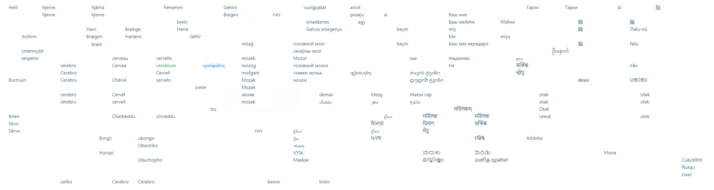

# Languages cluster

The 🗺 [2D language picker](lexi_map.PNG) keeps the constant position of each language no matter choosing which language to display. It solves the problem of one dimentional language pickers (re)ordering certain languages alphabetically at various positions that hard to find, e.g. *Deutsche* - _**A**leman_, _**I**naleman_, _**L**ialémani_, _**B**éésh bichʼahii_, _**C**eruman_, _**D**uits_, _**E**leman_, _**F**rangikos_, _**G**erman_, _**J**erman_, _**K**rzyżacki_, _**M**jymjecko_, _**Н**емецкий_, _**N**émet_, _**O**lmoni_, _**P**reisen_, _**R**ajchski_, _**S**aksa_, _**𐌸**𐌹𐌿𐌳𐌹𐍃𐌺𐌰𐍂𐌰𐌶𐌳𐌰_, _**Þ**ýska_, _**T**ysk_, _**U**budage_, _**V**ācu_, _**W**eimarische_, _**Y**oeraman_, _**Z**ėm_, etc.

🗺 is also availble in game as a cheatsheet (hit top menubar ⌨ for hotkeys).

### Design considerations:

  1. Easy to pick - align to grid
  2. Language lineage lead - Afrikaans, ייִדיש are placed at West Germanic blob
  3. Respect relative geolocation inter- and in- blobs
  4. Major languages at the top or bottom of blobs that quick to be found
  5. Extinct languages next to major languages - Classical Chinese, Aramaic, Sanskrit, Latin, Gothic, Ænglisc
  6. Isolated languages look isolated - Basque, Greek, Albanian, Armenian, Chuvash, etc.
  7. Screen real estate - no overlapping in most languages on 1300px minimum width
  8. Background image is only for decoration
